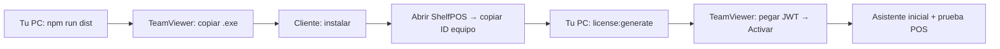

# ShelfPOS — Instalación remota (TeamViewer)

Guía repetible para instalar ShelfPOS en el PC de un cliente por TeamViewer, activar la licencia y dejar el sistema listo.

**Tiempo estimado:** 30–45 min (primera vez), 15–20 min (siguientes clientes).

> Si vas al local o envías una memoria USB, usa [instalacion-usb.md](./instalacion-usb.md).

---

## Antes de empezar

### En tu PC (tú / soporte)

| Requisito | Notas |
|-----------|--------|
| Código fuente actualizado | `OFFLINE-ONLY-POS` en tu máquina de desarrollo |
| Node.js + npm | Solo para **generar** el instalador y las licencias |
| `private/license.private.pem` | Llave privada RSA — **nunca** se envía al cliente |
| TeamViewer instalado | Cuenta para sesiones remotas |

### En el PC del cliente

| Requisito | Notas |
|-----------|--------|
| Windows 10/11 (64-bit) | Mismo equipo donde correrá el POS |
| TeamViewer (Host o QuickSupport) | El cliente te da ID y contraseña |
| Usuario con permisos de instalación | Admin local si el instalador lo pide |
| Impresora Epson (opcional) | TM-T81III / TM-T20 — instalar APD de Epson; ShelfPOS detecta la cola automáticamente |

### Archivos que llevas al cliente

1. **Instalador:** `dist/ShelfPOS Setup 1.0.0.exe` (nombre puede variar según versión)
2. **Clave de licencia:** JWT que generas tú (texto largo, una sola línea)

---

## Parte A — Preparar en tu PC (sin TeamViewer)

### A1. Compilar el instalador

```powershell
cd C:\Users\Jay\Desktop\ShelfPOS\OFFLINE-ONLY-POS
npm install
npm run dist
```

El instalador queda en:

```text
OFFLINE-ONLY-POS\dist\ShelfPOS Setup 1.0.0.exe
```

> **Tip:** Para probar rápido sin instalador: `npm run build` + `npm run start` (solo en tu PC de prueba).

### A2. Verificar que tienes llave de licencias

Si no existe `private/license.private.pem`:

```powershell
npm run license:keypair
```

Guarda una copia de seguridad de `private/` en un lugar seguro (USB cifrado, gestor de secretos). **No subas `private/` a Git.**

---

## Parte B — Conectar por TeamViewer

### B1. Pedir acceso al cliente

1. El cliente abre **TeamViewer QuickSupport** o **TeamViewer Host**.
2. Te envía **ID** y **contraseña** (o acepta tu invitación).
3. Te conectas desde tu TeamViewer.

### B2. Copiar el instalador al PC del cliente

Elige **una** opción:

| Método | Pasos |
|--------|--------|
| **Transferencia de archivos TeamViewer** | En la barra de TeamViewer: *Archivos y extras* → *Transferencia de archivos* → envía `ShelfPOS Setup x.x.x.exe` al Escritorio o `Descargas` |
| **USB** | Si estás físicamente cerca o el cliente inserta USB y tú navegas por remoto |
| **Nube** | Sube el `.exe` a Drive/Dropbox, descarga en el PC del cliente (menos ideal por tamaño) |

Deja el instalador en una ruta fácil, por ejemplo:

```text
C:\Users\<Cliente>\Downloads\ShelfPOS Setup 1.0.0.exe
```

---

## Parte C — Instalar en el PC del cliente

### C1. Ejecutar el instalador

1. En el escritorio remoto, doble clic en `ShelfPOS Setup x.x.x.exe`.
2. Si Windows SmartScreen pregunta: *Más información* → *Ejecutar de todas formas* (solo si confías en tu propio build).
3. Siguiente → elegir carpeta (por defecto está bien) → Instalar.
4. Al terminar, **no abras ShelfPOS todavía** si aún no tienes la licencia lista (ver Parte D).

### C2. Qué instala (referencia)

- Programa en `Archivos de programa` (o carpeta elegida)
- Acceso directo en el menú Inicio
- **Datos del negocio** (base de datos, licencia, respaldos) van aparte en:

```text
%APPDATA%\shelfpos\
```

Esa carpeta **no se borra** al actualizar o desinstalar el programa (por diseño).

---

## Parte D — Licencia (obligatorio en producción)

La app **no funciona** en producción sin licencia vinculada a **ese** PC.

### D1. Obtener el ID de equipo del cliente

**Opción 1 — Desde la pantalla de activación (recomendado)**

1. Abre **ShelfPOS** en el PC del cliente.
2. Aparece la ventana *Activación de licencia*.
3. Copia el valor del campo **ID de equipo** (cadena larga hexadecimal).

**Opción 2 — Desde tu repo (si copiaste el proyecto al cliente, poco habitual)**

En el PC del cliente, en una terminal con Node:

```powershell
npm run license:machine-id
```

En instalación normal **solo usas la Opción 1**.

### D2. Generar la clave en tu PC

En **tu** máquina de desarrollo (puedes hacerlo mientras sigues en TeamViewer en otra ventana):

```powershell
cd C:\Users\Jay\Desktop\ShelfPOS\OFFLINE-ONLY-POS
npm run license:generate -- --machine-id <ID_COPIADO_DEL_CLIENTE> --client "Nombre del negocio"
```

Con fecha de vencimiento (opcional):

```powershell
npm run license:generate -- --machine-id <ID> --client "Nombre" --expires 2026-12-31
```

La consola imprime **una línea larga** (JWT). Esa es la **clave de licencia**.

Cópiala completa (Ctrl+A en la terminal, o redirige a archivo):

```powershell
npm run license:generate -- --machine-id <ID> --client "Nombre" > licencia-cliente.txt
```

### D3. Activar en el PC del cliente

1. En TeamViewer, pega el JWT en el cuadro **Clave de licencia**.
2. Clic en **Activar**.
3. Si todo es correcto: mensaje de éxito y se abre ShelfPOS.

### Errores frecuentes

| Mensaje | Causa | Solución |
|---------|--------|----------|
| Licencia para otro equipo | `machine_id` del JWT no coincide | Regenerar licencia con el ID exacto de **ese** PC |
| Licencia inválida | JWT cortado, espacios, llave pública distinta | Pegar de nuevo; recompilar app con el mismo `license.pub.pem` |
| Licencia vencida | `expires_at` pasado | Generar licencia nueva con fecha futura o sin `--expires` |

---

## Parte E — Primera configuración del negocio

Tras activar la licencia (primera vez en ese PC):

1. **Idioma** — Español o 中文.
2. **Asistente inicial** — Crear cuentas:
   - Administrador
   - Cajero (`sales`)
   - Inventario (`product_manager`)
   - PIN de gerente / PIN de caja (descuentos)
3. **Configuración** (admin) — Nombre de tienda, datos de emisor, impresora si aplica.

Checklist rápido en remoto:

- [ ] Login cajero → abrir caja (POS) → venta de prueba
- [ ] Login admin → productos, cierre, efectivo
- [ ] Impresión de tiquete (si hay impresora)

---

## Parte F — Actualizar a una versión nueva

1. En tu PC: `npm run dist` (nueva versión).
2. TeamViewer al cliente.
3. Copiar nuevo `ShelfPOS Setup x.x.x.exe`.
4. Ejecutar instalador **encima** de la instalación anterior.
5. **No hace falta** reactivar licencia si `%APPDATA%\shelfpos\license.enc` sigue intacto.

---

## Checklist copiar/pegar (cada cliente)

```text
CLIENTE: _______________________  FECHA: __________  TeamViewer ID: __________

[ ] Instalador copiado al PC del cliente
[ ] ShelfPOS instalado
[ ] ID de equipo copiado: ________________________________________________
[ ] Licencia generada y guardada en tu registro
[ ] Activación exitosa en el cliente
[ ] Asistente inicial completado (idioma + cuentas + PIN)
[ ] Venta de prueba OK
[ ] (Opcional) Impresora OK
[ ] Cliente sabe usuario/contraseña cajero y admin
```

---

## Resumen del flujo



---

## Seguridad (recordatorio)

- **Nunca** envíes `private/license.private.pem` al cliente.
- **Sí** puedes enviar el JWT (clave de licencia); solo sirve en el PC con ese `machine_id`.
- Guarda un registro interno: cliente, ID de equipo, fecha de emisión, vencimiento.

---

## Comandos de referencia rápida

```powershell
# Compilar instalador
npm run dist

# ID del equipo (en tu PC de desarrollo; en cliente usar pantalla de activación)
npm run license:machine-id

# Emitir licencia
npm run license:generate -- --machine-id <ID> --client "Nombre del negocio"

# Probar build producción en TU PC (sin instalador)
npm run build
npm run start
```
