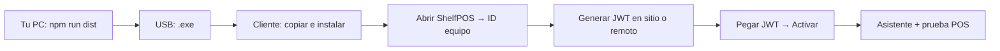
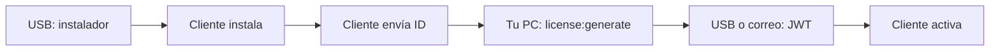

# ShelfPOS — Instalación con memoria USB

Guía repetible para instalar ShelfPOS en el PC de un cliente llevando el instalador en una memoria USB (visita presencial o envío del USB), activar la licencia y dejar el sistema listo.

**Tiempo estimado:** 30–45 min (primera vez en sitio), 15–20 min (siguientes clientes si ya tienes el flujo claro).

> Si prefieres instalar sin ir al local, usa [instalacion-remota.md](./instalacion-remota.md) (TeamViewer).

---

## Antes de empezar

### En tu PC (tú / soporte)

| Requisito | Notas |
|-----------|--------|
| Código fuente actualizado | `OFFLINE-ONLY-POS` en tu máquina de desarrollo |
| Node.js + npm | Solo para **generar** el instalador y las licencias |
| `private/license.private.pem` | Llave privada RSA — **nunca** va en el USB del cliente |
| Memoria USB formateada FAT32/exFAT | 1 GB libre es más que suficiente |

### En el PC del cliente

| Requisito | Notas |
|-----------|--------|
| Windows 10/11 (64-bit) | Mismo equipo donde correrá el POS |
| Puerto USB libre | Para la memoria (y opcionalmente impresora) |
| Usuario con permisos de instalación | Admin local si el instalador lo pide |
| Impresora Epson (opcional) | TM-T81III / TM-T20 — instalar APD de Epson; ShelfPOS detecta la cola automáticamente |

### Qué puede ir en el USB

| Archivo | ¿Obligatorio? | Notas |
|---------|---------------|--------|
| `ShelfPOS Setup x.x.x.exe` | Sí | Instalador compilado por ti |
| `licencia-cliente.txt` | Solo si ya tienes el JWT | Una línea con la clave de licencia |
| `LEEME.txt` (opcional) | No | Instrucciones cortas para el cliente si lo dejas solo |

**No pongas en el USB:** `private/license.private.pem`, código fuente completo, ni contraseñas de admin del negocio.

---

## Parte A — Preparar en tu PC (antes de ir al cliente)

### A1. Compilar el instalador

```powershell
cd C:\Users\Jay\Desktop\ShelfPOS\OFFLINE-ONLY-POS
npm install
npm run dist
```

El instalador queda en:

```text
OFFLINE-ONLY-POS\dist\ShelfPOS Setup 1.0.0.exe
```

> **Tip:** Para probar rápido sin instalador: `npm run build` + `npm run start` (solo en tu PC de prueba).

### A2. Verificar que tienes llave de licencias

Si no existe `private/license.private.pem`:

```powershell
npm run license:keypair
```

Guarda una copia de seguridad de `private/` en un lugar seguro (USB **tuyo** y cifrado, gestor de secretos). **No subas `private/` a Git.**

### A3. (Opcional) Licencia anticipada

Solo puedes generar la licencia **antes** de la visita si ya conoces el **ID de equipo** de ese PC (equipo ya usado, reinstalación, o te lo enviaron por otro medio).

```powershell
npm run license:generate -- --machine-id <ID> --client "Nombre del negocio" > licencia-cliente.txt
```

En la **primera instalación** en un PC nuevo, lo normal es generar la licencia **después** de copiar el ID en sitio (Parte D).

---

## Parte B — Preparar la memoria USB

### B1. Estructura recomendada

Copia al USB con nombres claros (sin espacios raros si puedes):

```text
E:\
  ShelfPOS\
    ShelfPOS Setup 1.0.0.exe
    licencia-cliente.txt          ← solo si ya la generaste
    LEEME.txt                     ← opcional
```

### B2. Contenido sugerido para `LEEME.txt`

```text
ShelfPOS — instalación

1. Copie la carpeta ShelfPOS al Escritorio o a Descargas.
2. Ejecute "ShelfPOS Setup 1.0.0.exe" y siga el asistente.
3. Abra ShelfPOS. Si pide licencia, copie el "ID de equipo" y envíelo a soporte.
4. Cuando reciba la clave, péguela en la pantalla de activación.

Soporte: [tu teléfono / correo]
```

### B3. Antes de desconectar el USB

1. Espera a que Windows termine de escribir (icono de USB sin actividad).
2. *Expulsar* el volumen desde el icono de la bandeja (evita `.exe` corrupto).
3. Etiqueta física en el USB: versión (`1.0.0`) y fecha.

---

## Parte C — En el PC del cliente (con USB)

### C1. Copiar del USB al disco local

No instales directamente desde el USB si puedes evitarlo (más lento y a veces bloqueado por políticas). Copia primero:

```text
Origen:  E:\ShelfPOS\ShelfPOS Setup 1.0.0.exe
Destino: C:\Users\<Cliente>\Downloads\ShelfPOS Setup 1.0.0.exe
```

### C2. Ejecutar el instalador

1. Doble clic en `ShelfPOS Setup x.x.x.exe` **desde el disco local**.
2. Si Windows SmartScreen pregunta: *Más información* → *Ejecutar de todas formas* (solo si confías en tu propio build).
3. Siguiente → carpeta por defecto → Instalar.
4. Al terminar, abre ShelfPOS para el paso de licencia (Parte D), o déjalo cerrado si aún no tienes JWT.

### C3. Qué instala (referencia)

- Programa en `Archivos de programa` (o carpeta elegida)
- Acceso directo en el menú Inicio
- **Datos del negocio** (base de datos, licencia, respaldos) van aparte en:

```text
%APPDATA%\shelfpos\
```

Esa carpeta **no se borra** al actualizar o desinstalar el programa (por diseño).

---

## Parte D — Licencia (obligatorio en producción)

La app **no funciona** en producción sin licencia vinculada a **ese** PC.

### D1. Obtener el ID de equipo

**En sitio (recomendado)**

1. Abre **ShelfPOS** en el PC del cliente.
2. En *Activación de licencia*, copia el **ID de equipo** (cadena hexadecimal larga).
3. Anótalo en tu checklist o envíatelo a ti mismo (foto, WhatsApp, correo).

**Si no estás en sitio**

El cliente abre ShelfPOS, copia el ID y te lo manda. Sin ese ID no puedes emitir la licencia.

### D2. Generar la clave (en tu PC de desarrollo)

```powershell
cd C:\Users\Jay\Desktop\ShelfPOS\OFFLINE-ONLY-POS
npm run license:generate -- --machine-id <ID_COPIADO> --client "Nombre del negocio"
```

Con vencimiento (opcional):

```powershell
npm run license:generate -- --machine-id <ID> --client "Nombre" --expires 2026-12-31
```

Guardar en archivo para llevar en USB:

```powershell
npm run license:generate -- --machine-id <ID> --client "Nombre" > licencia-cliente.txt
```

### D3. Entregar la licencia al cliente

Elige **una** opción:

| Método | Cuándo usarlo |
|--------|----------------|
| **Mismo USB, segunda pasada** | Generas en tu PC, copias `licencia-cliente.txt` al USB, vuelves al cliente o envías el USB |
| **WhatsApp / correo** | Pegas solo la línea JWT (es seguro: solo vale en ese PC) |
| **En sitio con laptop** | Llevas tu portátil, generas ahí y pegas en ShelfPOS al momento |

**Activación en el cliente**

1. Abre `licencia-cliente.txt` o pega el JWT desde el mensaje.
2. En ShelfPOS → cuadro **Clave de licencia** → pegar → **Activar**.
3. Mensaje de éxito → continúa el asistente inicial.

### Errores frecuentes

| Mensaje | Causa | Solución |
|---------|--------|----------|
| Licencia para otro equipo | `machine_id` del JWT no coincide | Regenerar con el ID exacto de **ese** PC |
| Licencia inválida | JWT cortado, espacios, llave pública distinta | Pegar de nuevo; recompilar app con el mismo `license.pub.pem` |
| Licencia vencida | `expires_at` pasado | Generar licencia nueva con fecha futura o sin `--expires` |
| No se puede ejecutar el .exe | Antivirus o instalación desde USB dañado | Copiar a `Downloads` y volver a expulsar/copiar el USB |

---

## Parte E — Primera configuración del negocio

Tras activar la licencia (primera vez en ese PC):

1. **Idioma** — Español o 中文.
2. **Asistente inicial** — Crear cuentas:
   - Administrador
   - Cajero (`sales`)
   - Inventario (`product_manager`)
   - PIN de gerente / PIN de caja (descuentos)
3. **Configuración** (admin) — Nombre de tienda, datos de emisor, impresora si aplica.

Checklist en sitio:

- [ ] Login cajero → abrir caja (POS) → venta de prueba
- [ ] Login admin → productos, cierre, efectivo
- [ ] Impresión de tiquete (si hay impresora)
- [ ] Retirar el USB del PC del cliente (no dejarlo conectado en producción)

---

## Parte F — Actualizar a una versión nueva (USB)

1. En tu PC: `npm run dist` (nueva versión).
2. Copia el nuevo `ShelfPOS Setup x.x.x.exe` al USB (carpeta `ShelfPOS\`).
3. En el cliente: copiar a `Downloads` → ejecutar instalador **encima** de la instalación anterior.
4. **No hace falta** reactivar licencia si `%APPDATA%\shelfpos\license.enc` sigue intacto.

Puedes dejar el USB en el local solo como medio de actualización; documenta la versión en una etiqueta.

---

## Flujos según cómo trabajes

### Un solo viaje (ideal)

Llevas instalador en USB → instalas → copias ID → generas licencia con tu laptop en el local (o hotspot + tu PC por RDP) → activas → asistente inicial.



### Dos pasos (envío de USB o visita corta)

1. **Visita 1 o USB solo con instalador:** cliente o tú instaláis; el cliente te envía el ID de equipo.
2. **Tu PC:** `license:generate` → guardas JWT.
3. **Visita 2, correo o USB con `licencia-cliente.txt`:** activación y configuración.



---

## Checklist copiar/pegar (cada cliente)

```text
CLIENTE: _______________________  FECHA: __________  USB etiqueta: __________

[ ] Instalador copiado al USB (versión: _______)
[ ] Instalador copiado del USB al disco del cliente
[ ] ShelfPOS instalado
[ ] ID de equipo copiado: ________________________________________________
[ ] Licencia generada y guardada en tu registro
[ ] Activación exitosa
[ ] Asistente inicial completado (idioma + cuentas + PIN)
[ ] Venta de prueba OK
[ ] (Opcional) Impresora OK
[ ] USB retirado del PC del cliente
[ ] Cliente sabe usuario/contraseña cajero y admin
```

---

## Seguridad (recordatorio)

- **Nunca** copies `private/license.private.pem` al USB que entregas al cliente.
- **Sí** puedes enviar el JWT (clave de licencia); solo sirve en el PC con ese `machine_id`.
- Si el USB se pierde, el riesgo es bajo (solo contiene el instalador público y quizá un JWT de un solo equipo). Igual conviene USB dedicado por cliente o borrar `licencia-cliente.txt` tras activar.
- Guarda registro interno: cliente, ID de equipo, fecha de emisión, vencimiento.

---

## Comandos de referencia rápida

```powershell
# Compilar instalador
npm run dist

# ID del equipo (en tu PC de desarrollo; en cliente usar pantalla de activación)
npm run license:machine-id

# Emitir licencia y guardar para el USB
npm run license:generate -- --machine-id <ID> --client "Nombre del negocio" > licencia-cliente.txt

# Probar build producción en TU PC (sin instalador)
npm run build
npm run start
```
