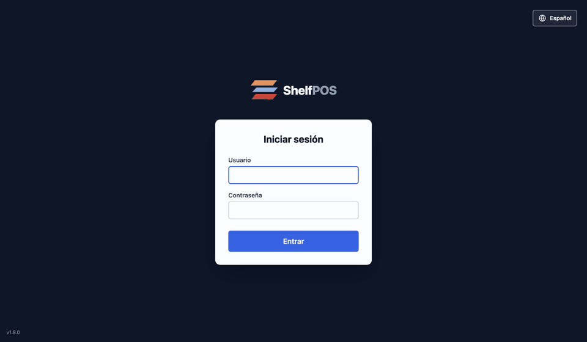
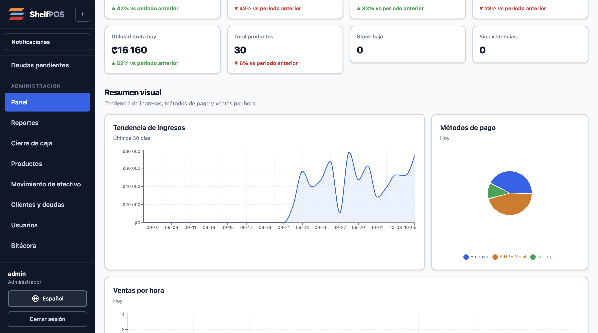
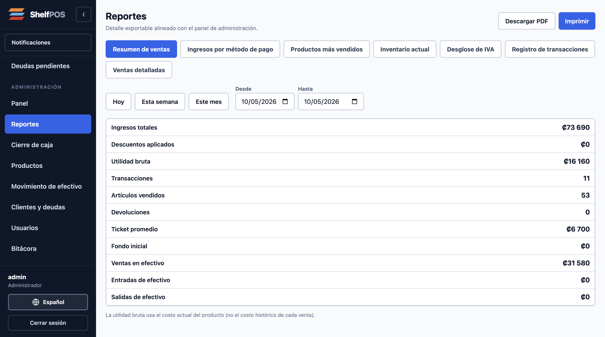
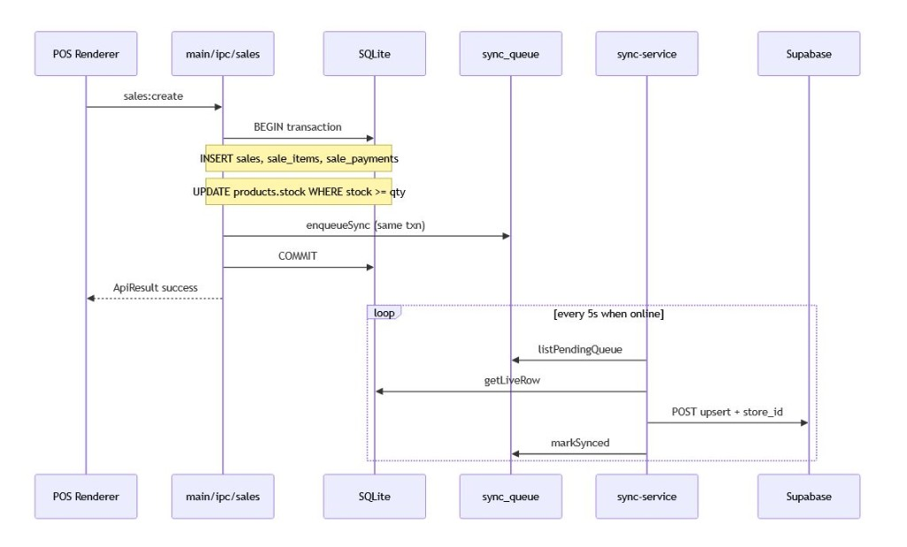
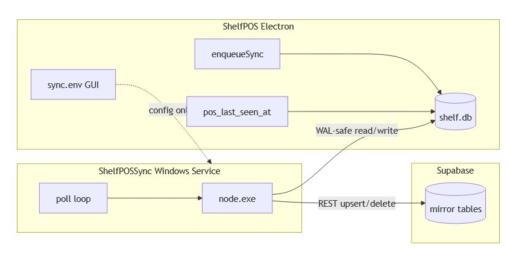
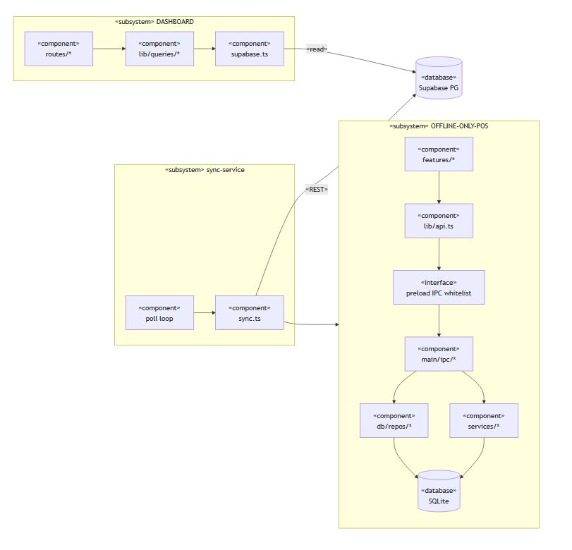
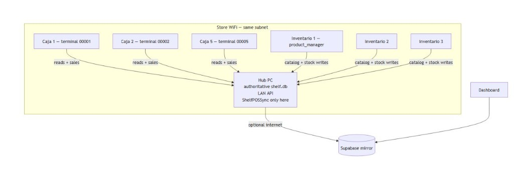

# ShelfPOS

Offline-first Windows register. The shop keeps selling when the network drops. Two stores run it live.

Local SQLite (WAL) is the source of truth. A checkout is one transaction: the sale, its lines, its payments, a stock decrement that refuses to go negative (`WHERE stock >= qty`), and a `sync_queue` row. The cloud cannot miss a sale, and it cannot invent one.

A separate Windows service, ShelfPOSSync, polls that queue every 5 seconds and upserts to Supabase. It keeps draining after the register app closes. Sync is one-way. The owner dashboard is read-only.



[53-second walkthrough (MP4)](docs/media/shelfpos-demo.mp4): cashier sale, then the admin dashboard, product search, and reports.

| Admin dashboard | Reports |
|---|---|
|  |  |

The UI ships in Spanish and Simplified Chinese. Every screen above runs on a throwaway demo database (fake catalog, generated sales). No store data.

## Architecture

```
Electron renderer
  → IPC (window.api.invoke)
  → main process (every payload checked with Zod)
  → SQLite WAL
       one transaction: sale + lines + payments
                        + stock decrement WHERE stock >= qty
                        + sync_queue row
  → ShelfPOSSync Windows service (5s poll, survives app exit)
  → Supabase
  → owner dashboard (read-only; RLS scopes each owner to their stores)
```

Checkout is one SQLite transaction. The sync service is a separate process and only runs when the machine is online.







On the shop network, registers and inventory PCs use one shelf.db on the hub PC. Only that PC runs ShelfPOSSync. The cloud copy is optional.



Hardware on the register: a USB barcode scanner (keyboard-burst detection) and an ESC/POS thermal printer for shelf tags and CODE128 labels.

Mirrored rows are keyed `(id, store_id)`, and row-level security limits each dashboard user to the stores they own. Registers write with a server-side Supabase key, so the register PC is a trusted device. A register joins a store with a single-use 8-character pairing code that expires in 24 hours.

## Where the interesting code is

- Checkout transaction: [`shelfPos/src/main/ipc/sales.ts`](shelfPos/src/main/ipc/sales.ts)
- Sync worker: [`shelfPos/sync-service/src/sync.ts`](shelfPos/sync-service/src/sync.ts)
- Owner dashboard: live at [shelfpos.net](https://shelfpos.net), code in [FortakenJay/ShelfPOS-Dashboard](https://github.com/FortakenJay/ShelfPOS-Dashboard)

Dev setup, tests, and the Windows installer are in [`shelfPos/README.md`](shelfPos/README.md).

## License

Commercial product with paying stores. There is no open-source license. All rights reserved.
