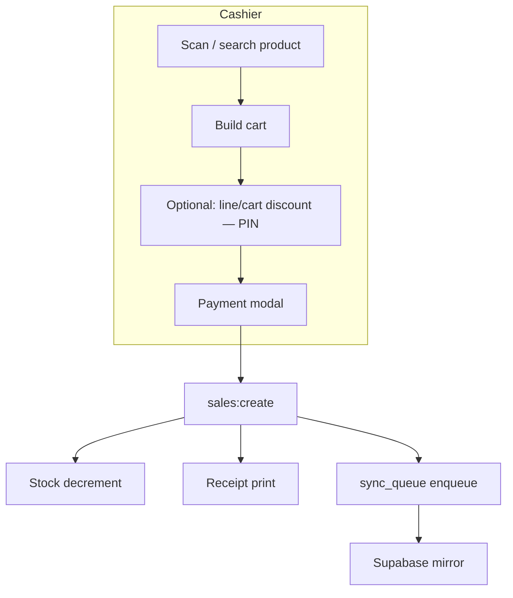

# Business Rules & Domain Knowledge

Parent: [LLM Index](README.md)

LLMs need business context before code. These rules are **product decisions** — do not "fix" them without an explicit requirement.

## Glossary

| Term | Meaning |
|------|---------|
| **Product** | Catalog SKU with unique barcode, price, stock |
| **Misc item** | Temporary line via `PRECIO*` (e.g. `3000*`) — no catalog row |
| **Sale / ticket** | Completed transaction (`sales` + lines + payments) |
| **Receipt** | Thermal print of a sale |
| **Factura** | A4 PDF invoice layout (Costa Rica style grid) |
| **Cierre** | End-of-shift close with cash count and totals |
| **Devolución** | Return/refund of catalog lines |
| **Cart tab** | One of several open carts on a single register |
| **Store** | Tenant unit identified by `sync_store_id` |
| **Pairing code** | 8-char code linking a POS PC to a dashboard owner |
| **Mirror** | Supabase copy of POS data for dashboard reads |

## Product rules

- One barcode = one product row. **No variants** (no size/color matrix).
- `stock_provider` (optional) labels supplier (e.g. Walmart) — filter only, not inventory logic.
- Soft delete: `deleted_at` set instead of hard delete when product has history.
- Bulk pricing: `bulk_qty` + `bulk_price` when quantity threshold met.

## Misc items (`PRECIO*`)

```
Cashier types: 3000*
    ↓
No product row created
    ↓
sale_items.product_id = NULL
    ↓
Name in product_name_snapshot
    ↓
NOT returnable (by design)
```

| Rule | Detail |
|------|--------|
| Parse | `src/shared/miscItem.ts` |
| Return search | `product_id IS NOT NULL` filter — misc sales with only misc lines omitted |
| Restock | N/A — no inventory row |

## Sale flow



### Payment methods

- **cash**, **card**, **sinpe** (Costa Rica mobile payment)
- Split payments stored in `sale_payments` (canonical for reports)
- Cash sales can open drawer (ESC/POS pulse)

### Customer on sale

Optional fields on sale header (name, cédula) — not a separate customers table.

## Inventory rules

| Event | Stock change |
|-------|----------------|
| Sale | Decrement in `sales:create` transaction |
| Return (restock) | Increment in `returns:create` |
| Manual adjustment | `stock_adjustments` delta |
| Misc sale | No stock change |

**Race safety:** `UPDATE products SET stock = stock - ? WHERE id = ? AND stock >= ?` — `changes === 0` → `errors.outOfStock`.

## Cart tabs

- Multiple open carts per register (like browser tabs).
- **Local only** — not synced; snapshot in `cart_tabs.cart_json`.
- Switching tabs saves/restores cart state.
- Closing empty tab: no PIN. Closing with items: **caja/manager PIN** → `audit_log` (synced) → appears on cierre print.

## Barcode scanner

USB HID scanners type digits rapidly + Enter.

| Setting | `scanner_burst_ms` (default 30) |
|---------|----------------------------------|
| Meaning | Max ms between keys to classify as scan vs manual typing |
| Tune | Admin → Settings; try 50–100ms for slow Bluetooth scanners |

Enter handler reads **live input value** (not stale React state). Numeric fallback tries `byBarcode` when burst detection fails.

## Money display (CRC)

| Surface | Symbol | Helper |
|---------|--------|--------|
| Screen UI | **₡** (colón) | `formatColones` in `shared/money.ts` |
| Thermal print | **¢** (cent, CP850) | `formatColonesPrint` + `encodePrintText` in `printer.ts` |

Receipts include footer `print.receipt.centDisclaimer` explaining ¢ = colón costarricense.

## Product label printing

| Type | Use | Notes |
|------|-----|-------|
| Shelf etiqueta | Display stand (name + price) | 20 mm; `products:printLabel` |
| Barcode sticker | Scan at POS | CODE128; uses barcode or **product id** if no código |
| Batch | Restock / new inventory | `items[]` with `copies` 1–99; max 200 products |

Not returnable misc lines do not affect label printing.

## Roles (POS)

| Role | Typical access |
|------|----------------|
| `sales` | POS terminal, reprints |
| `product_manager` | Products, stock |
| `admin` | All admin screens, settings, users |

IPC enforces roles again in main process.

## Dashboard tenancy

- Owner sees only stores in `store_access`.
- Superadmin (`app_metadata.role`) sees all stores for support.
- Dashboard **cannot** insert sales — RLS blocks mirror writes.

## PIN-gated actions

Discounts over threshold, price overrides, line removal, cart tab discard, some cierre actions — require manager/caja PIN; PIN hash in `settings`.

## Related

- [Architecture](03-architecture.md)
- [Features](06-features.md)
- [Wiki: Edge cases](../wiki/19-Edge-Cases-And-Runbooks.md)
