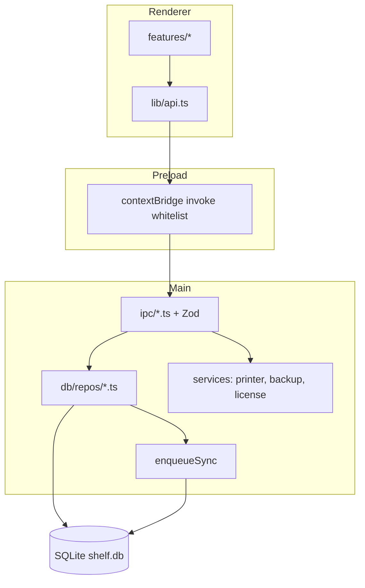
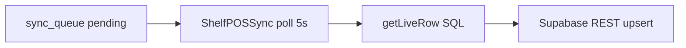
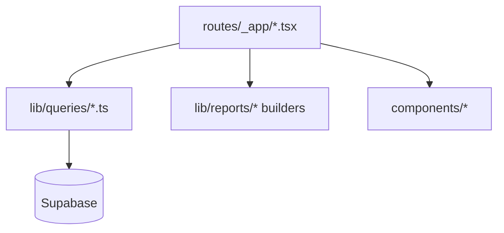
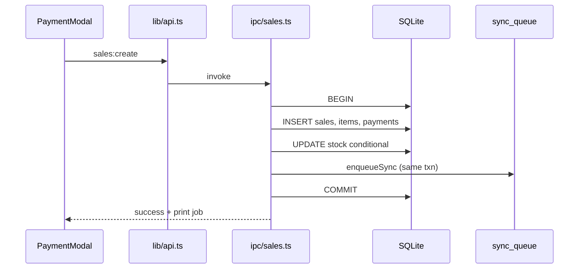
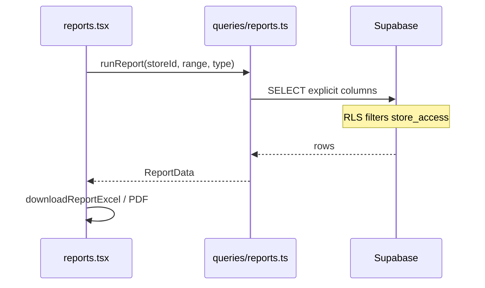
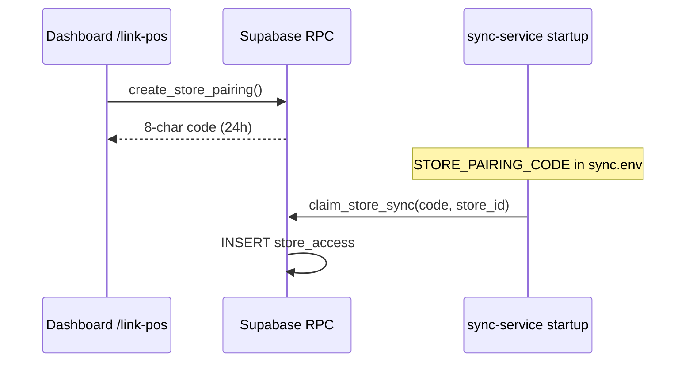

# System Architecture

Parent: [LLM Index](README.md)

## Design principles

1. **Offline-first** — POS works with zero network.
2. **SQLite is source of truth** — Supabase is a read mirror for dashboard.
3. **One-way sync** — Dashboard never writes mirror tables.
4. **Multi-tenant cloud** — `store_id` on every mirror row + RLS.
5. **Layered UI** — Components → hooks → API/IPC → repos.

## POS process architecture

## Sync process (separate from Electron)

- **Not** spawned by Electron — Windows Service via installer.
- Config: `%APPDATA%\shelfpos\sync.env` (secret key, URL, pairing code).
- Retries: max 10 per row → status `error` → `sync.txt` log.

## Dashboard architecture

**Providers** (`_app/route.tsx`): Query persist → Auth → Store selection → Shell.

## Request flow: sale checkout

## Request flow: dashboard report

## ID model

| Layer | IDs |
|-------|-----|
| SQLite | `INTEGER AUTOINCREMENT` per table |
| Supabase | Composite PK `(id, store_id)` |

Sale `id=5` on `store_a` ≠ sale `id=5` on `store_b`.

## Synced vs local tables

**Synced:** `products`, `sales`, `sale_items`, `sale_payments`, `cierres`, `cash_movements`, `audit_log`, `return_items`, `stock_adjustments`, `pos_users`

**Local only:** `settings`, `users`, `print_jobs`, `cart_tabs`, `sync_queue`

## Claim / pairing flow

## Related

- [Database](04-database.md)
- [Wiki: Data flow](../wiki/03-Data-Flow.md)
- [Wiki: Sync service](../wiki/10-Sync-Service.md)
