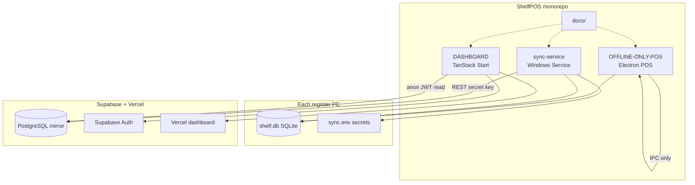
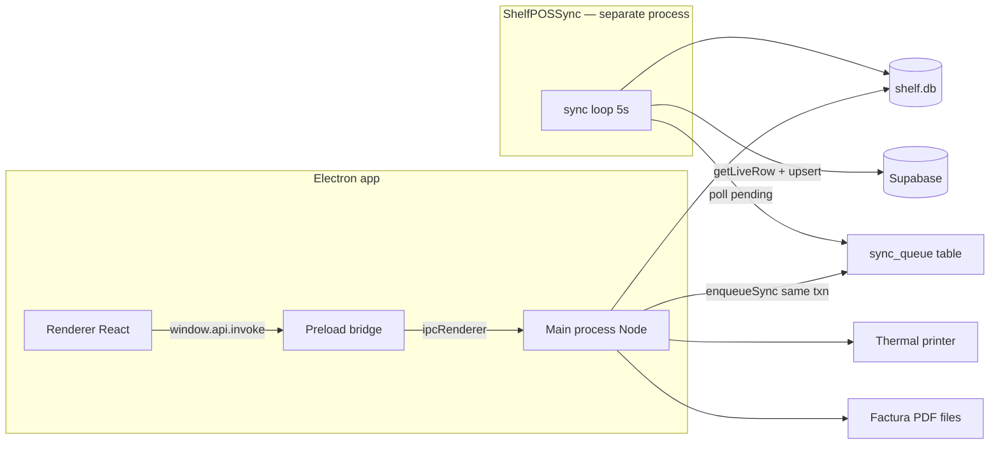
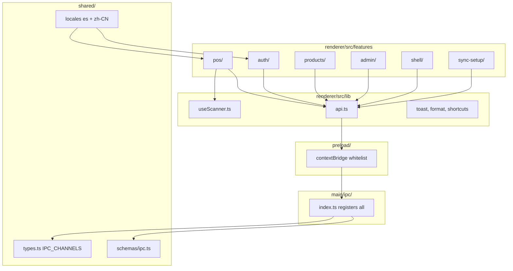
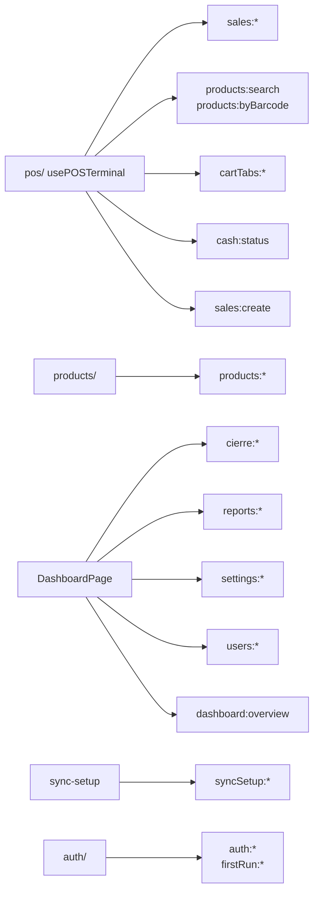
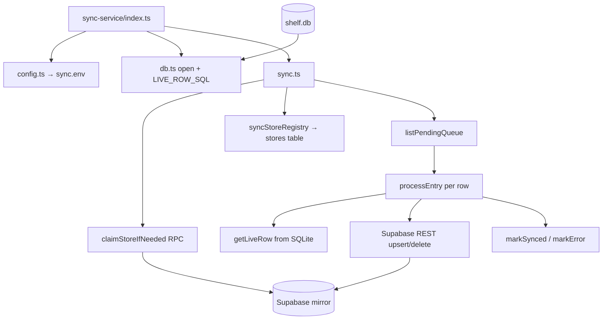
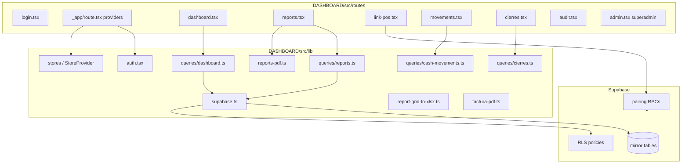
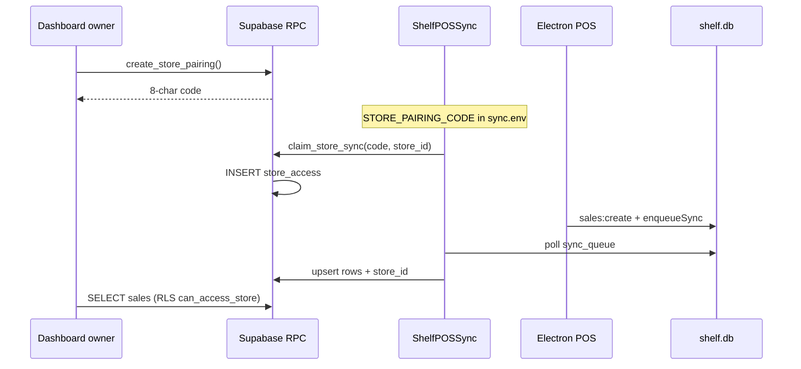
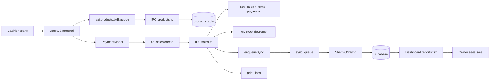

# ShelfPOS — Codebase Dependency Graph

Parent: [LLM Index](README.md)

Visual map of **who talks to whom** across the monorepo. Open in Obsidian, GitHub, or any Mermaid preview.

**Interactive canvas (Cursor):** [shelfpos-codebase-graph.canvas.tsx](/Users/Jay/.cursor/projects/c-Users-Jay-Desktop-ShelfPOS/canvases/shelfpos-codebase-graph.canvas.tsx)

**UML diagrams:** [09-uml-diagrams.md](09-uml-diagrams.md) — deployment, component, class, sequence, state, ER

---

## How to read these graphs

| Arrow | Meaning |
|-------|---------|
| `A --> B` | A calls, invokes, reads, or depends on B |
| `subgraph` | Logical boundary (folder / process) |
| Dashed mental model | Sync is async — POS does not wait on Supabase |

**Three runtimes on a shop PC:** Electron renderer, Electron main, ShelfPOSSync Windows Service — all share `shelf.db`.

---

## Level 0 — Monorepo bird's eye

---

## Level 1 — POS: three processes, one database

---

## Level 2 — Renderer features → API → IPC

### Feature → primary IPC channels

---

## Level 3 — IPC handlers → repos & services

```mermaid
flowchart TB
  subgraph IPC_HANDLERS["main/ipc/*.ts"]
    sales_ts[sales.ts]
    products_ts[products.ts]
    cierre_ts[cierre.ts]
    returns_ts[returns.ts]
    cash_ts[cash.ts]
    cartTabs_ts[cartTabs.ts]
    users_ts[users.ts]
    settings_ts[settings.ts]
    reports_ts[reports.ts]
    syncSetup_ts[syncSetup.ts]
    printer_ts[printer.ts]
    audit_ts[audit.ts]
  end

  subgraph REPOS["main/db/repos/"]
    products_r[products.ts]
    sales_r[salesReceipt.ts]
    stock_r[stock.ts]
    cash_r[cash.ts]
    cartTabs_r[cartTabs.ts]
    users_r[users.ts]
    settings_r[settings.ts]
    reports_r[reports.ts]
    audit_r[audit.ts]
    printJobs_r[printJobs.ts]
    syncQ_r[syncQueue.ts]
    dashboard_r[dashboard.ts]
  end

  subgraph SERVICES["main/services/"]
    session[session.ts]
    printer_s[printer.ts]
    printTpl[printTemplates.ts]
    factura[facturaPdf.ts]
    backup[backup.ts]
    syncCfg[syncConfig.ts]
    csvImp[productCsvImport.ts]
  end

  DB[(SQLite)]

  sales_ts --> products_r
  sales_ts --> stock_r
  sales_ts --> cash_r
  sales_ts --> sales_r
  sales_ts --> syncQ_r
  sales_ts --> printJobs_r
  sales_ts --> printer_s
  sales_ts --> session

  products_ts --> products_r
  products_ts --> syncQ_r
  products_ts --> csvImp
  products_ts --> printer_s

  cierre_ts --> reports_r
  cierre_ts --> cash_r
  cierre_ts --> syncQ_r
  cierre_ts --> printTpl

  returns_ts --> products_r
  returns_ts --> syncQ_r

  users_ts --> users_r
  users_ts --> syncQ_r

  cartTabs_ts --> cartTabs_r

  syncSetup_ts --> syncCfg

  REPOS --> DB
  SERVICES --> DB
```

---

## Level 4 — Repos → SQLite tables

```mermaid
flowchart TB
  subgraph SYNCED["Synced tables → sync_queue → Supabase"]
    products[(products)]
    sales[(sales)]
    sale_items[(sale_items)]
    sale_payments[(sale_payments)]
    cierres[(cierres)]
    cash_mov[(cash_movements)]
    audit[(audit_log)]
    returns[(return_items)]
    stock_adj[(stock_adjustments)]
    pos_users[(pos_users mirror)]
  end

  subgraph LOCAL_ONLY["Local only"]
    settings[(settings)]
    users[(users passwords)]
    print_jobs[(print_jobs)]
    cart_tabs[(cart_tabs)]
    sync_queue[(sync_queue)]
  end

  products_r[repos/products] --> products
  products_r --> stock_adj
  sales_r[repos/salesReceipt] --> sales
  sales_r --> sale_items
  sales_r --> sale_payments
  cash_r[repos/cash] --> cash_mov
  cash_r --> cierres
  cartTabs_r[repos/cartTabs] --> cart_tabs
  users_r[repos/users] --> users
  users_r --> pos_users
  syncQ_r[repos/syncQueue] --> sync_queue
  audit_r[repos/audit] --> audit
  settings_r[repos/settings] --> settings
  printJobs_r[repos/printJobs] --> print_jobs
```

---

## Level 5 — Sync service internals

**Column parity:** `sync-service/src/db.ts` `LIVE_ROW_SQL` ↔ `DASHBOARD/SUPA.sql` ↔ `migrations.ts`

---

## Level 6 — Dashboard layers

**Dashboard never writes mirror rows** — RLS denies authenticated INSERT/UPDATE on business tables.

---

## Level 7 — Tenancy & pairing

---

## Level 8 — End-to-end sale (cross-system)

---

## Dependency rules (for impact analysis)

| If you change… | Also check… |
|----------------|-------------|
| `migrations.ts` | `sync-service/db.ts`, `SUPA.sql`, repos, IPC schemas |
| `schemas/ipc.ts` | `api.ts`, preload channels, handler |
| `repos/products.ts` | `ipc/products.ts`, `ipc/sales.ts`, sync LIVE_ROW_SQL |
| `usePOSTerminal.ts` | `useScanner.ts`, `posKeyboard.ts`, `PaymentModal` |
| `queries/reports.ts` | report tables, `report-grid-to-xlsx.ts`, RLS |
| `SUPA.sql` | RLS policies, dashboard queries, sync upsert columns |
| `sync.ts` | claim flow, `19-Edge-Cases` runbook |

---

## Related

- [Dependency maps (text trees)](05-dependency-maps.md)
- [Architecture](03-architecture.md)
- [Code index](07-code-index.md)
- [Master context](../shelfpos_context.md)
