# ShelfPOS — UML Diagrams

Parent: [LLM Index](README.md) · Related: [Codebase graph](08-codebase-graph.md)

Standard **UML views** of ShelfPOS using [Mermaid](https://mermaid.js.org/) (renders in GitHub, Obsidian, and many IDEs).

| Diagram type | UML intent | Section |
|--------------|------------|---------|
| Deployment | Nodes & artifacts | [§1](#1-deployment-diagram) |
| Component | Packages & interfaces | [§2](#2-component-diagram) |
| Class | Domain model | [§3](#3-domain-class-diagram) |
| Class | Application layers | [§4](#4-application-layer-class-diagram) |
| Sequence | Checkout | [§5](#5-sequence-checkout) |
| Sequence | Barcode scan | [§6](#6-sequence-barcode-scan) |
| Sequence | Sync queue | [§7](#7-sequence-sync-queue) |
| State | `sync_queue` row | [§8](#8-state-machine-sync_queue) |
| State | Cart tab lifecycle | [§9](#9-state-machine-cart-tab) |
| Activity | `onEnter` decision | [§10](#10-activity-onenter) |
| ER | Persistent entities | [§11](#11-entity-relationship-diagram) |

---

## 1. Deployment diagram

Physical/runtime nodes and what runs where.

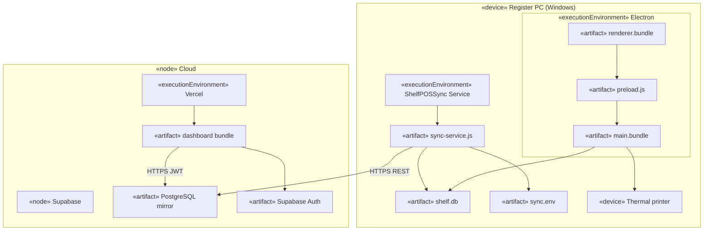

---

## 2. Component diagram

Logical components and provided/required interfaces.

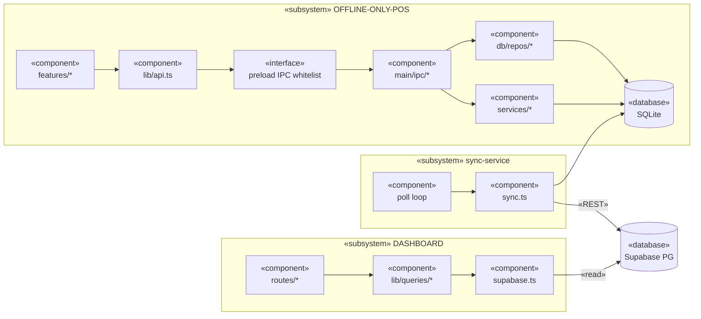

---

## 3. Domain class diagram

Core business types (`src/shared/types.ts`) and relationships.

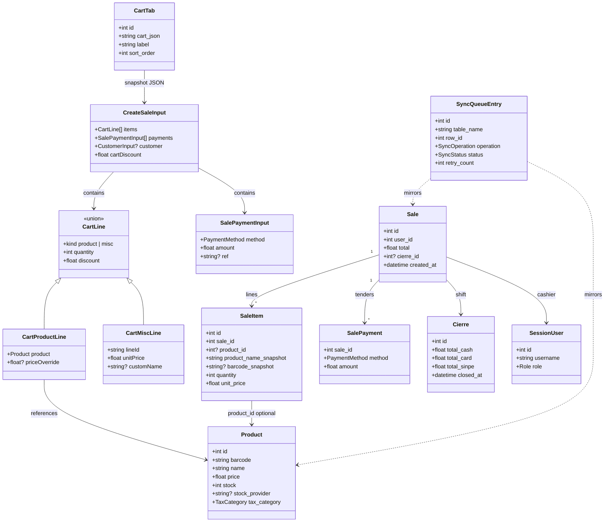

---

## 4. Application layer class diagram

POS internal layers (simplified).

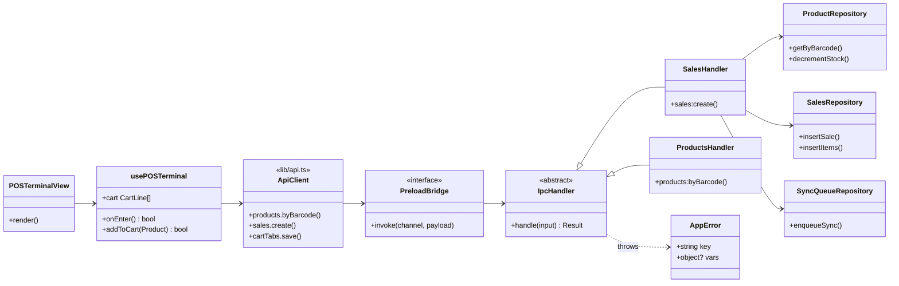

---

## 5. Sequence — checkout

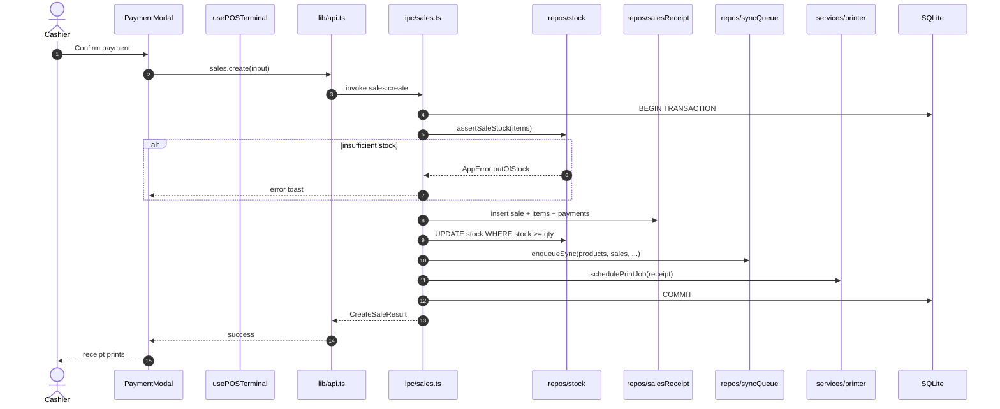

---

## 6. Sequence — barcode scan

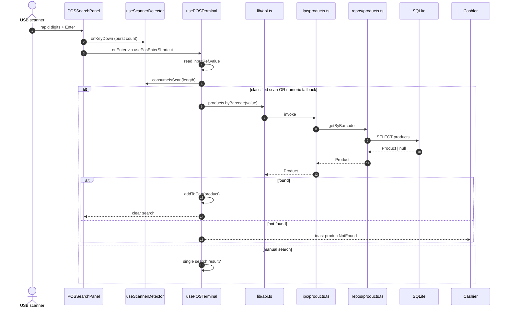

---

## 7. Sequence — sync queue

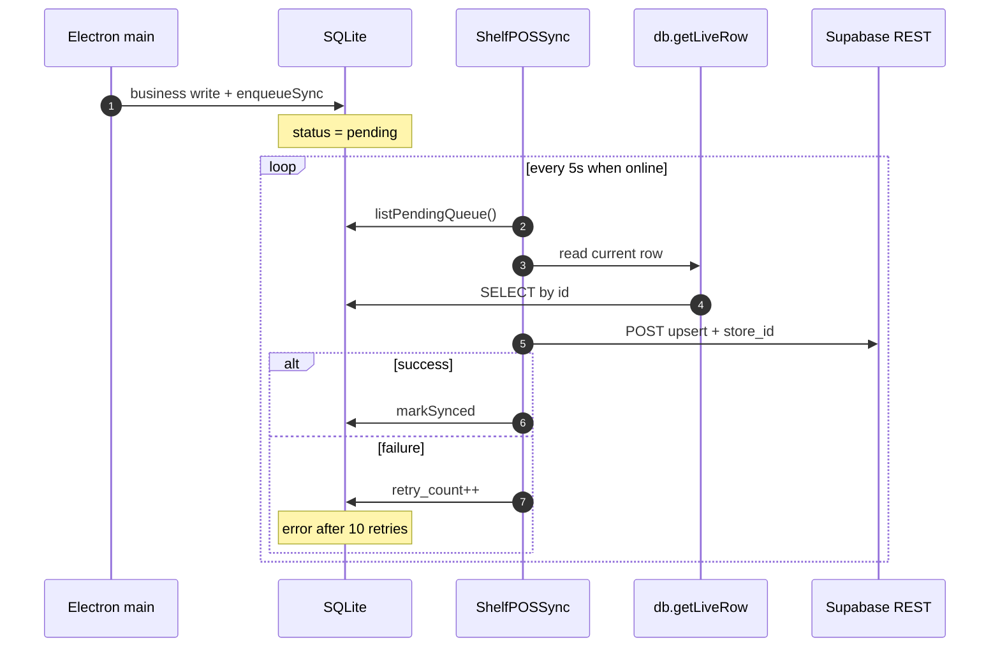

---

## 8. State machine — `sync_queue`

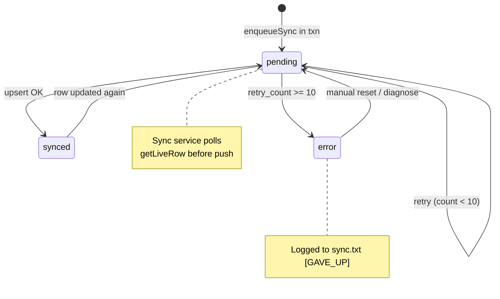

---

## 9. State machine — cart tab

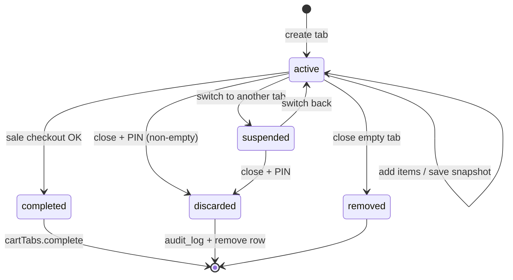

---

## 10. Activity — `onEnter`

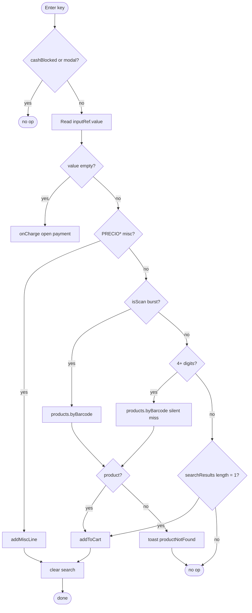

---

## 11. Entity-relationship diagram

Persistent schema (SQLite source of truth). Supabase mirror uses same entities + `store_id`.

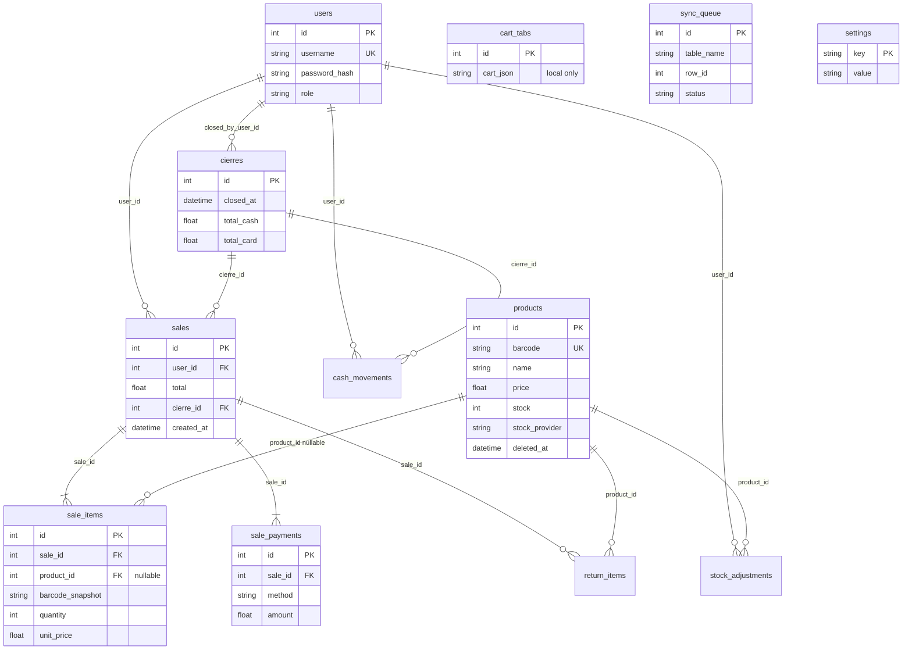

---

## 12. Dashboard component diagram (UML)

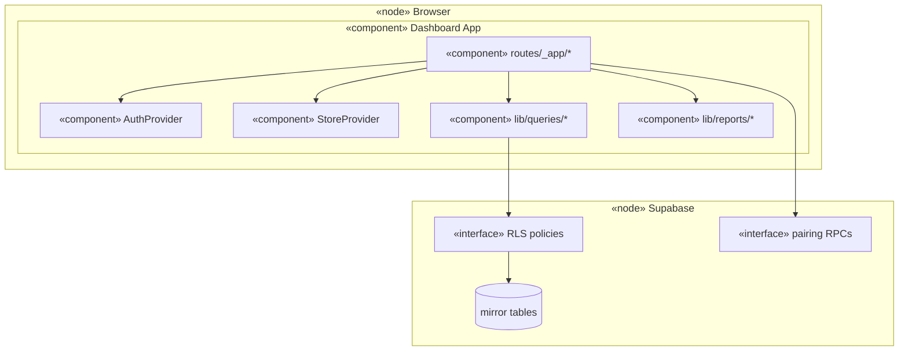

---

## PlantUML export (optional)

If your tool prefers PlantUML, equivalent checkout sequence:

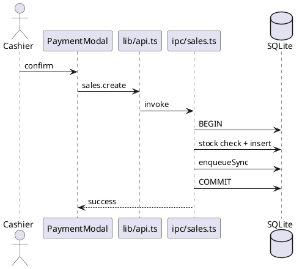

Paste into [plantuml.com](https://www.plantuml.com/plantuml) or a PlantUML Obsidian plugin.

---

## Related

- [Codebase dependency graph](08-codebase-graph.md) — flowcharts by zoom level
- [Architecture](03-architecture.md)
- [Database reference](04-database.md)
- [Master LLM context](../shelfpos_context.md)
