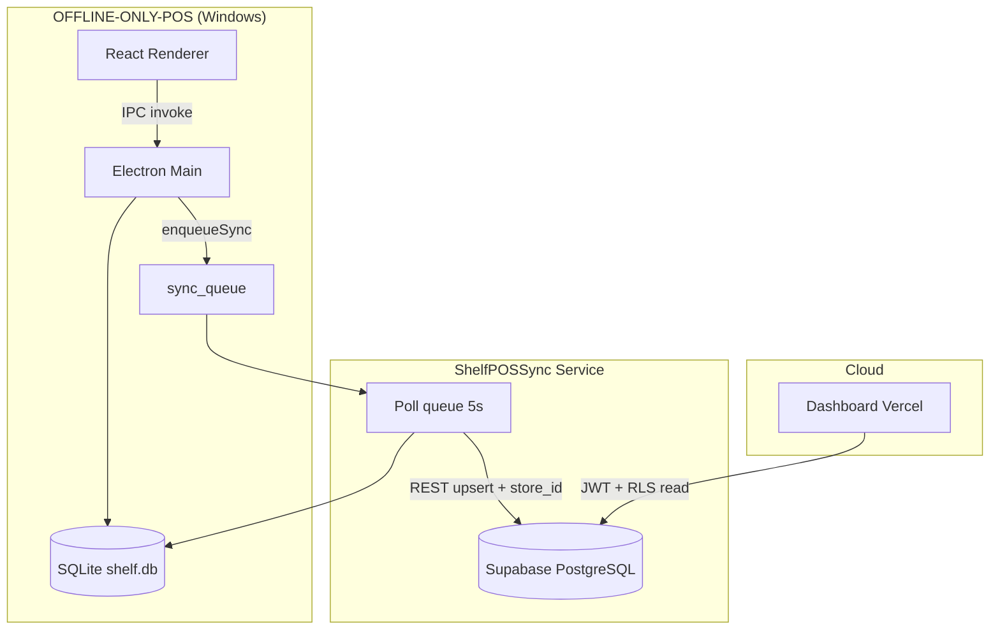
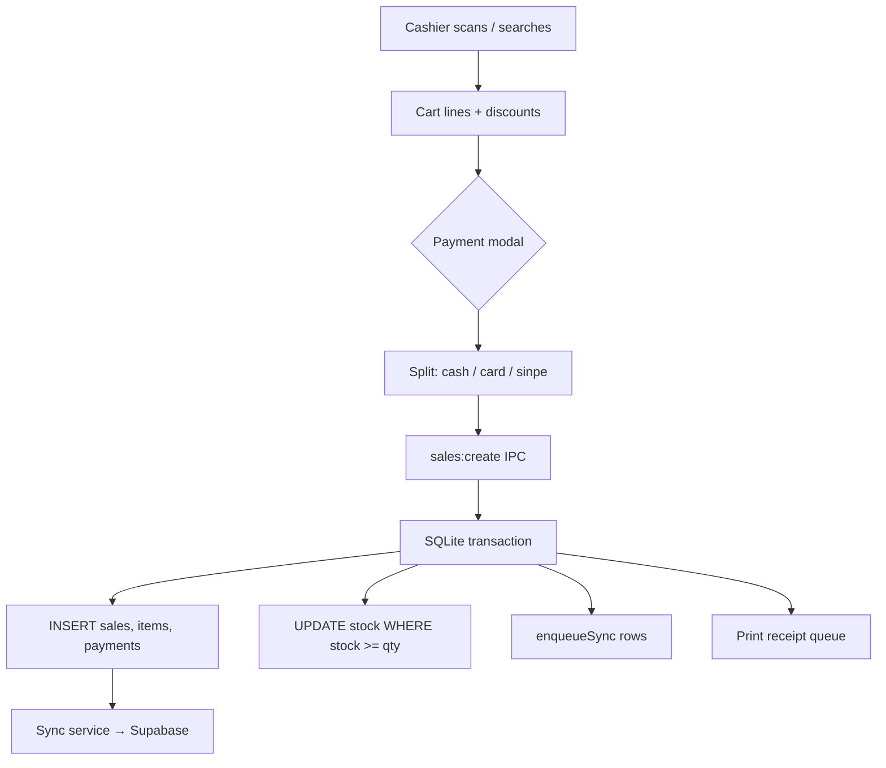
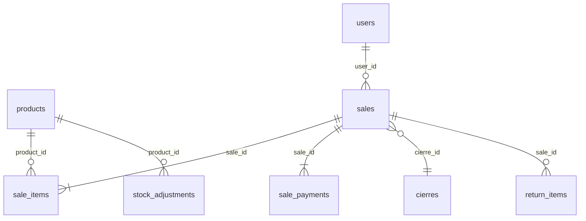

# ShelfPOS — LLM Context Document

> **Start here.** Single-file context for AI agents and new developers.  
> Expanded chapters: [`docs/llm/README.md`](llm/README.md) · Human wiki: [`docs/wiki/Home.md`](wiki/Home.md)

---

## Project identity

| Field | Value |
|-------|--------|
| **Name** | ShelfPOS |
| **Version** | 1.5.0 (monorepo apps) |
| **Purpose** | Offline-first retail POS for small shops (Costa Rica focus) with optional cloud owner dashboard |
| **Repo layout** | `OFFLINE-ONLY-POS/` (Electron), `DASHBOARD/` (web), `sync-service/` (Windows background sync) |
| **Not in repo** | Root `package.json` — each app installs independently |

---

## What is ShelfPOS?

ShelfPOS is **not** a cloud-native POS. The cashier PC runs a **Windows Electron app** that works with **zero internet**. Sales, inventory, and cash drawer logic live in **SQLite** (`%APPDATA%\shelfpos\shelf.db`).

An optional **cloud dashboard** (TanStack Start on Vercel) lets store owners view reports, link registers, and manage team access. The dashboard reads a **Supabase PostgreSQL mirror** — it does **not** write sales data back to registers.

A **background sync service** (`ShelfPOSSync`) on each PC polls a local `sync_queue` and pushes changes to Supabase using a secret API key.

---

## Business goals

- **Process sales** — barcode scan, search, cart, split payments (cash / card / SINPE), receipts, factura PDF
- **Manage inventory** — stock per product, adjustments, returns with optional restock
- **Operate shifts** — opening float, cash in/out, **cierre** (shift close) with discrepancy tracking
- **Govern access** — POS roles (sales, product_manager, admin), PIN-gated discounts and overrides
- **Report to owners** — dashboard KPIs, multi-type reports, Excel/PDF export
- **Multi-tenant cloud** — one Supabase project, many stores isolated by RLS + `store_access`

---

## Tech stack (accurate)

| Layer | Technology |
|-------|------------|
| POS desktop | **Electron 28+**, **React 19**, **TanStack Router**, **TanStack Query**, Tailwind |
| POS data | **better-sqlite3** (main process only) |
| POS ↔ UI | **IPC** (`ipcMain.handle` + Zod schemas + preload whitelist) |
| Sync | **Node 24** Windows Service, better-sqlite3, **Supabase REST** (no SDK) |
| Dashboard | **TanStack Start**, React 19, **TanStack Query**, Supabase JS client |
| Cloud DB | **Supabase** (PostgreSQL + Auth + RLS) |
| i18n | `es.json`, `zh-CN.json` (shared error keys POS main + renderer) |

**Not used:** Next.js, Redux, Firebase, direct renderer → Supabase writes.

---

## Architecture summary



**Golden rules:**

1. **SQLite is source of truth** for all sales and inventory mutations.
2. **One-way sync** — dashboard never writes mirror tables (RLS blocks authenticated writes).
3. **Composite tenancy** — Supabase PK is `(id, store_id)`; `store_id` from POS `settings.sync_store_id`.
4. **Layered renderer** — UI → hooks → `lib/api.ts` → IPC → repos (no SQLite/Supabase in components).

---

## Main modules

| Module | POS | Dashboard | Description |
|--------|-----|-----------|-------------|
| Authentication | `features/auth/` | `lib/auth.tsx`, `/login` | Local POS users; Supabase Auth for owners |
| Products / catalog | `features/products/` | Reports inventory | Barcode, price, stock, optional `stock_provider` |
| POS terminal | `features/pos/` | — | Cart, scan, payment, cart tabs |
| Sales & returns | `main/ipc/sales.ts`, `returns.ts` | Reports | Checkout, devoluciones, factura PDF |
| Cash & cierre | `features/admin/`, `ipc/cierre.ts` | `/cierres`, `/movements` | Float, movements, shift close |
| Reports | `features/admin/reports/` (local SQLite) | `/reports` | Summary, payments, tax, itemized, etc. |
| Sync & pairing | `features/sync-setup/`, `sync-service/` | `/link-pos` | Pair register to owner |
| Users & audit | `features/admin/UsersPage` | `/audit` | POS users, audit log mirror |
| Settings | `features/admin/SettingsPage` | — | Tax, printer, scanner threshold, PINs |

**No standalone Customers module** — optional customer name/cedula captured on sale header fields.

**No product variants** — one row per SKU/barcode.

---

## Domain glossary & business rules

### Product

A catalog item with unique `barcode`, `price`, `stock`, optional `category`, `stock_provider` (supplier label), bulk pricing, tax category.

- Soft-deleted via `deleted_at` (v9) — not physically removed if sales exist.
- Stock decremented on sale inside IPC transaction with race-safe `WHERE stock >= ?`.

### Misc item (`PRECIO*`)

Cashier enters e.g. `3000*` for a one-off line **without** a catalog product.

- `sale_items.product_id` is **NULL**; name in `product_name_snapshot`.
- **Not returnable** by design — return search filters `product_id IS NOT NULL`.
- **Do not "fix"** this filter unless product explicitly requests misc returns.

### Sale / Receipt

A completed transaction: `sales` header + `sale_items` lines + `sale_payments` (split payments canonical).

- `barcode_snapshot` on lines at checkout (v14) for factura/report grids.
- Linked to `cierre_id` when shift is open.

### Cart tab

Browser-style multi-cart on one register (`cart_tabs` table, **local only**, not synced).

- Snapshot JSON: `{ cart, cartDiscount, customer }`.
- Discarding non-empty tab requires caja/manager PIN → `audit_log` (synced).

### Cierre

Shift close — totals by payment method, cash count, discrepancy, discarded cart tabs in print/PDF.

### Return (devolución)

Reverses catalog lines; optional restock. Misc lines excluded from return search.

### Store / tenancy

Each POS install has `sync_store_id` (e.g. `store_a`). Owner links via 8-char pairing code → `store_access` row.

---

## Sale flow



**Authoritative validation** is in `main/ipc/sales.ts`, not only the renderer.

---

## Database tables (SQLite — source of truth)

**Schema version:** `SCHEMA_VERSION = 20` in `migrations.ts`.

### Synced to Supabase (`SYNC_TABLES`)

`products`, `sales`, `sale_items`, `sale_payments`, `cierres`, `cash_movements`, `audit_log`, `return_items`, `stock_adjustments`, `pos_users`

### Local only

`settings`, `users` (passwords), `print_jobs`, `cart_tabs`, `sync_queue`

### Key tables

#### `products`

| Column | Notes |
|--------|-------|
| `id` | INTEGER PK |
| `barcode` | UNIQUE, used at POS scan |
| `name`, `price`, `cost_price`, `category` | Catalog |
| `stock`, `stock_threshold` | Inventory |
| `stock_provider` | Optional supplier (v20, synced) |
| `tax_category`, `bulk_qty`, `bulk_price` | Tax & bulk pricing |
| `factura_negativo` | Invoice display flag |
| `deleted_at` | Soft delete |

**Relationships:** `products.id` → `sale_items.product_id`, `stock_adjustments.product_id`, `return_items.product_id`

#### `sales`

Header: `user_id`, `total`, discounts, customer fields (`customer_name`, `customer_cedula`, …), `cierre_id`, `created_at`.

**Relationships:** `sales.id` → `sale_items.sale_id`, `sale_payments.sale_id`

#### `sale_items`

| Column | Notes |
|--------|-------|
| `product_id` | NULL for misc lines |
| `product_name_snapshot` | Name at sale time |
| `barcode_snapshot` | Barcode at sale time (v14) |
| `quantity`, `unit_price`, `line_total`, `discount` | Line economics |

#### `sale_payments`

Split payments: `method` ∈ `cash` | `card` | `sinpe`, `amount`. **Canonical** for dashboard — not legacy `sales.payment_method` alone.

#### `sync_queue`

`table_name`, `row_id`, `operation`, `status` (pending | synced | error), `retry_count` (max 10).

#### `cart_tabs` (local)

`cart_json` snapshot per open tab; `sort_order`, `label`.

#### `settings` (key-value)

Important keys: `sync_store_id`, `store_name`, `scanner_burst_ms` (default 30), `sync_owner_claimed`, tax/PIN/printer keys.

**Supabase mirror:** see `DASHBOARD/SUPA.sql` and `docs/wiki/06-Supabase-Schema.md`. All mirror tables include `store_id`.

---

## Entity relationship (simplified)



---

## POS screen dependency map

```
POSTerminalView
 ├── CartTabsBar          (multi-cart switch)
 ├── POSSearchPanel       (search + scan input)
 ├── POSCartPanel         (lines, qty, discounts)
 ├── POSSidebar           (pay, return, cash, reprint)
 ├── PaymentModal         (checkout)
 ├── ReturnModal
 ├── POSModals            (PIN, price override, customer)
 └── usePOSTerminal       (all state + IPC orchestration)
      ├── useScanner.ts   (barcode burst detection)
      ├── posKeyboard.ts  (focus, Enter shortcut)
      └── lib/api.ts      (IPC facade)
```

---

## Main process dependency map

```
ipc/index.ts
 ├── sales.ts        → repos/sales, products, syncQueue
 ├── products.ts     → repos/products
 ├── cierre.ts       → repos/cierre, printTemplates
 ├── cartTabs.ts     → repos/cartTabs (local)
 ├── returns.ts      → repos/returns
 └── settings.ts     → repos/settings

db/repos/*.ts       → SQL only
syncQueue.ts        → enqueueSync (same transaction as writes)
```

---

## Dashboard dependency map

```
routes/_app/
 ├── dashboard.tsx   → lib/queries/dashboard.ts
 ├── reports.tsx     → lib/queries/reports.ts, reports-pdf.ts
 ├── movements.tsx   → cash movements query
 ├── cierres.tsx
 ├── link-pos.tsx    → pairing RPCs
 └── audit.tsx

lib/queries/*.ts    → Supabase selects (explicit columns, no select *)
lib/reports/        → PDF + Excel builders (report-grid-to-xlsx.ts)
```

---

## Feature index (entry points)

| Feature | Entry | Tables | Permissions | Edge cases |
|---------|-------|--------|-------------|------------|
| **Checkout** | `PaymentModal` → `sales:create` | sales, sale_items, sale_payments, products | sales+ | Out of stock race; misc lines |
| **Barcode scan** | `usePOSTerminal.onEnter`, `useGlobalBarcodeScanner` | products | sales+ | `scanner_burst_ms`; stale Enter fixed via inputRef |
| **Returns** | `ReturnModal` → `returns:create` | return_items, products | PIN | Misc not returnable |
| **Stock adjust** | Products admin | stock_adjustments | product_manager+ | Synced |
| **Cierre** | `CierrePage` → `cierre:confirm` | cierres, cash_movements | admin/caja PIN | Discarded tabs in audit |
| **Cart tab discard** | `cartTabs:discardAudited` | cart_tabs, audit_log | caja/manager PIN | Local cart only |
| **Inventory report** | Dashboard `/reports` | products (mirror) | owner RLS | 200/page cap |
| **Store pairing** | `/link-pos` + sync startup | store_pairings, store_access | owner | 24h single-use code |

---

## Code index — where things live

| Concern | Path |
|---------|------|
| **Codebase dependency graphs** | `docs/llm/08-codebase-graph.md` |
| **UML diagrams** | `docs/llm/09-uml-diagrams.md` |
| Migrations / schema | `OFFLINE-ONLY-POS/src/main/db/migrations.ts` |
| Column lists | `src/main/db/columns.ts` |
| IPC handlers | `src/main/ipc/*.ts` |
| IPC channels + types | `src/shared/types.ts`, `schemas/ipc.ts` |
| Renderer API | `src/renderer/src/lib/api.ts` |
| POS terminal | `src/renderer/src/features/pos/` |
| Products admin | `src/renderer/src/features/products/` |
| Admin (cierre, reports, settings) | `src/renderer/src/features/admin/` |
| Auth / first run | `src/renderer/src/features/auth/` |
| Scanner | `src/renderer/src/lib/useScanner.ts` |
| Locales | `src/shared/locales/es.json`, `zh-CN.json` |
| Sync service | `sync-service/src/sync.ts`, `db.ts` |

### DASHBOARD

| Concern | Path |
|---------|------|
| Routes | `src/routes/` |
| Supabase queries | `src/lib/queries/` |
| Auth + store context | `src/lib/auth.tsx`, store provider in `_app/route.tsx` |
| Reports export | `src/lib/reports/`, `report-grid-to-xlsx.ts` |
| Supabase DDL | `SUPA.sql` |
| Production wipe script | `scripts/wipe-supabase-mirror-data.sql` |

### Docs

| Doc | Path |
|-----|------|
| **This file** | `docs/shelfpos_context.md` |
| LLM chapters | `docs/llm/` |
| Human wiki (Obsidian) | `docs/wiki/` |
| ADRs | `docs/decisions/` |

---

## Error handling contract

- IPC: throw `AppError('errors.someKey')` — never raw `Error`.
- Every key in **both** `es.json` and `zh-CN.json`.
- Renderer: `toastApiError(toasts, err)`.
- Stock: conditional SQL update; `changes === 0` → `errors.outOfStock`.
- Scan miss: `errors.productNotFound` (renderer toast after `byBarcode`).

---

## Known problems & pitfalls

| Problem | Cause | Doc |
|---------|-------|-----|
| Sales on POS, not dashboard | Sync stopped, wrong `store_id`, claim never ran | `wiki/19-Edge-Cases-And-Runbooks.md` |
| Stale `sync_owner_claimed` after cloud wipe | Local flag set, `store_access` gone | Sync startup clears + re-pair |
| Barcode scans but no add | `scanner_burst_ms` too low, product missing, modal open | Raise to 50–100ms; check catalog |
| `no such column: stock_provider` | Migration v20 not run | Restart POS; `SCHEMA_VERSION=20` |
| Partial dashboard data | `sync_queue` status `error` after 10 retries | `queue:diagnose`, `sync.txt` |
| Double-scan oversell (rare) | `addToCart` stock check uses stale closure | Known; fix in `setCart` callback |
| Misc sales hidden from returns | **By design** | Do not remove filter without requirement |
| Wipe with wrong SQL role | RLS → 0 rows deleted | Run as **postgres** in SQL Editor |
| Dashboard writes to mirror | Blocked by RLS — use POS for data changes | Architecture |

---

## Decision records

See `docs/decisions/`:

- **ADR-001** — SQLite source of truth (offline-first)
- **ADR-002** — One-way sync via queue + Windows service
- **ADR-003** — Electron IPC boundary (no DB in renderer)
- **ADR-004** — Multi-tenant RLS + pairing codes

---

## Quality commands

```bash
cd OFFLINE-ONLY-POS && npm run lint && npx react-doctor@latest --verbose --scope changed
cd DASHBOARD && npm run lint && npx react-doctor@latest --verbose --scope changed
cd OFFLINE-ONLY-POS/sync-service && npm run build
```

---

## What to read next

| Task | Read |
|------|------|
| Edit POS sale logic | `main/ipc/sales.ts`, `wiki/03-Data-Flow.md` |
| Edit sync | `sync-service/src/sync.ts`, `wiki/10-Sync-Service.md` |
| Schema change | `wiki/17-Conventions-For-AI.md` checklist |
| Deploy / pair store | `wiki/15-Setup-And-Deployment.md` |
| Troubleshoot | `wiki/19-Edge-Cases-And-Runbooks.md` |
