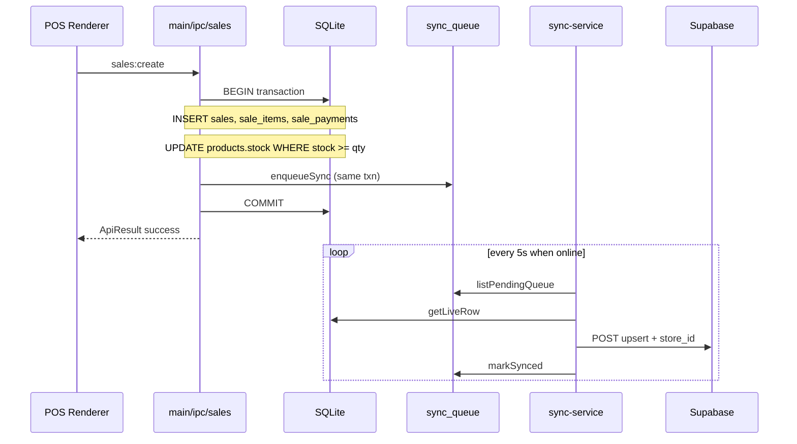

# Data Flow

Parent: [[Home]]

## Sale checkout (happy path)



**Key file:** `OFFLINE-ONLY-POS/src/main/ipc/sales.ts`

### Invariants enforced in IPC (authoritative)

- Stock: conditional `UPDATE … WHERE stock >= ?`; `changes === 0` → `errors.outOfStock`
- Cart validation duplicated in renderer (toast) + IPC (transaction)
- `barcode_snapshot` stored on `sale_items` at checkout (v14) for factura grid

## Sync trigger (what the POS does)

The POS does **not** push to Supabase directly. On every mirrored write:

1. IPC/repo runs SQL inside a transaction
2. `enqueueSync(table, rowId, operation)` inserts into `sync_queue` (same transaction)
3. **`ShelfPOSSync`** (separate Windows Service) polls the queue and pushes

See [[10-Sync-Service]] for process architecture, retry policy, and failure recovery.

## Sync queue priority

`listPendingQueue` orders tables so parents tend to drain before children:

`sales` → `sale_items` → `sale_payments` → `cierres` → `cash_movements` → …

Within a batch of up to 100 rows, entries are sent **in parallel** (`Promise.all`). Retries heal ordering glitches.

**Retries:** max 10 per row; then status `error` (gave up). Logs: `%APPDATA%\shelfpos\error\sync.txt`

### Partial sync example

A cash sale enqueues `sale_items`, `sale_payments`, and `sales`. If `sale_items` fails on Supabase but `sales` succeeds, the sale header appears in the dashboard while line items retry on the next poll. Each queue row is independent.

## Store registry heartbeat

1. POS `posHeartbeat.ts` writes `settings.pos_last_seen_at` every 30s
2. sync-service `syncStoreRegistry()` upserts `stores` row
3. Dashboard `fetchStorePresence()` — online if seen within 45s

## Dashboard read path

```typescript
// Typical query pattern
getSupabase()
  .from('sales')
  .select('id, total, created_at, …')
  .eq('store_id', storeId)  // app filter
// RLS also enforces store_access membership
```

Aggregations live in `DASHBOARD/src/lib/queries/dashboard.ts` and `reports.ts` — **not** in JSX.

## Claim / tenancy flow

See [[04-Multi-Tenant-Security]] and [[15-Setup-And-Deployment]].

1. Owner signs up on **production** dashboard URL
2. **Vincular POS** (`/link-pos`) → `create_store_pairing()` → 8-char code (24h, single use)
3. On **that shop's PC:** `STORE_CLAIM_CODE` in `sync.env` → restart `ShelfPOSSync`
4. Sync startup → `claim_store_sync()` → `store_access` row + `sync_owner_claimed` in SQLite
5. Owner refreshes → `fetchStores()` returns only RLS-allowed stores

## Related

- [[10-Sync-Service]]
- [[05-SQLite-Schema]]
- [[06-Supabase-Schema]]
