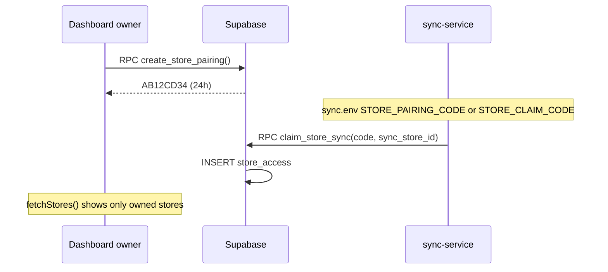

# Multi-Tenant Security

Parent: [[Home]]

## Problem

One Supabase project serves **many store owners** (e.g. your mom + a customer). Without tenancy, any authenticated dashboard user could read **all** mirrored data.

## Solution

| Piece | Purpose |
|-------|---------|
| `store_access` | Maps `auth.users.id` → `store_id` with role `owner` / `viewer` |
| `store_pairings` | One-time 24h codes to link a POS install to an owner |
| `can_access_store(store_id)` | RLS helper — membership or superadmin |
| `claim_store_sync(code, store_id)` | Service-role RPC; binds store to code owner |

**File:** `DASHBOARD/SUPA.sql` sections 4b and 5.

## RLS rules (dashboard)

- **Authenticated users:** `SELECT` on mirror tables **only** where `can_access_store(store_id)`.
- **Writes:** blocked on all mirror tables for `authenticated` role.
- **Sync service:** uses **service role key** → bypasses RLS for upserts/deletes.

## Pairing model (`store_pairings`)

Each row is a **single-use, 24h** code that links **one** POS `store_id` to the owner. Replaces legacy `store_claim_codes` (migrated in `SUPA.sql`).

| Column | Purpose |
|--------|---------|
| `pairing_code` | 8-char code shown in dashboard |
| `label` | Optional hint ("Caja 2") |
| `linked_store_id` / `linked_at` | Set when sync claims |

**RPCs:** `create_store_pairing(label)`, `list_pending_pairings()`, `ensure_store_pairing()`, `claim_store_sync(code, store_id, display_name)`.

Owners can have **multiple pending codes** (one per new register).

## Claim flow



**UI:** `DASHBOARD/src/routes/_app/link-pos.tsx`  
**Sync:** `sync-service/src/sync.ts` → `claimStoreIfNeeded()`

### Claim hardening

- `claim_store_sync` is **service_role only**
- Rejects if **another user** already owns `store_id`
- Codes are single-use and expire

## Superadmin

Role is read from JWT **`app_metadata.role`** (not `user_metadata` — users can edit that).

Set via Supabase Admin API / dashboard user editor:

```json
{ "role": "superadmin" }
```

Superadmin bypasses `can_access_store` for support.

## Service role key risks

The sync service holds the **project service role key** on each POS PC. Anyone with that key can write all mirror data. Mitigations:

- Key stays on server/PC, not in dashboard bundle
- Dashboard reads use **anon key + RLS**
- Claim cannot steal an **already-owned** store

## Migrating existing stores

After running `SUPA.sql`, assign owners manually:

```sql
INSERT INTO public.store_access (user_id, store_id, role)
VALUES ('<uuid-from-auth-users>', 'their_sync_store_id', 'owner')
ON CONFLICT DO NOTHING;
```

## Production onboarding (summary)

1. **You:** `SUPA.sql` + deploy dashboard (Vercel) — once.
2. **Per shop:** install POS + sync with unique `sync_store_id`.
3. **Owner:** sign up on live dashboard → **Vincular POS** → claim code.
4. **That PC only:** `STORE_CLAIM_CODE` in `%APPDATA%\shelfpos\sync.env` → restart `ShelfPOSSync`.

Full steps: [[15-Setup-And-Deployment]].

## Related

- [[06-Supabase-Schema]]
- [[15-Setup-And-Deployment]]
- [[10-Sync-Service]]
