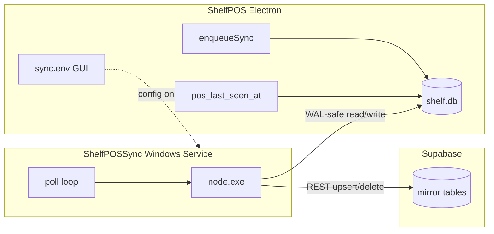

# Sync Service

Parent: [[Home]]

**Package:** `OFFLINE-ONLY-POS/sync-service/` (`@shelfpos/sync-service`)

The sync service is a **separate Node.js process** that mirrors SQLite changes to Supabase. The Electron POS does **not** run the sync loop — it only writes the queue and heartbeat.

### Why a separate Windows Service?

Electron has no reliable OS background primitive on Windows (unlike mobile). Options were: sync only while the app is open, tray + autostart, or a **Windows Service**. ShelfPOS uses a service so:

- `sync_queue` keeps draining after app **crash**, **update**, or **close** (pending rows are not stuck until someone reopens the POS)
- Sync and cashier UI are **separate crash domains**
- Service role key and retry logic stay out of the renderer/main UI process

Tradeoff: **two-step install** (`Setup.exe` + `Install-ShelfPOS`). See [[15-Setup-And-Deployment]] for updates.

---

## What runs it?

| Question | Answer |
|----------|--------|
| **Process type** | Standalone Node.js (`node.exe` + `dist/index.js`) |
| **Windows (production)** | Windows Service **`ShelfPOSSync`** via **`node-windows`** (WinSW wrapper) |
| **Scheduled task?** | **No** — persistent service, not Task Scheduler |
| **Spawned by Electron?** | **No** — installed separately; POS can only **restart** the service |
| **macOS** | Example `launchd` plist in `sync-service/launchd/` (dev reference only) |

### Windows install layout

| Item | Path / name |
|------|-------------|
| Display name (`services.msc`) | **ShelfPOSSync** |
| Internal SCM name (`sc.exe`, `Get-Service`, POS restart) | **`shelfpossync.exe`** |
| Binaries | `C:\Program Files\ShelfPOS\sync-service\` |
| Entry point | `dist/index.js` (bundled `node.exe`) |
| Installer | `OFFLINE-ONLY-POS/scripts/Install-ShelfPOS.ps1` → `install-windows-service.cjs` |
| Service logs | `C:\Program Files\ShelfPOS\sync-service\logs\` |

The service receives `SHELFPOS_SYNC_CONFIG=%APPDATA%\shelfpos\sync.env` at install time (`install-windows-service.cjs`).

### WinSW / node-windows chain

Registration uses **`node-windows`** (WinSW XML wrapper), not a raw `sc.exe create` on `dist/index.js`.

```text
SCM service shelfpossync.exe
  → C:\Program Files\ShelfPOS\sync-service\node.exe
  → node_modules\node-windows\lib\wrapper.js
  → --file C:\Program Files\ShelfPOS\sync-service\dist\index.js
```

`install-windows-service.cjs` sets `workingDirectory` to the sync-service folder, `SHELFPOS_SYNC_CONFIG` to the cashier's `%APPDATA%\shelfpos\sync.env`, and `logpath` to `logs\`.

**Install timing:** node-windows may log **"service is running"** before SCM shows `RUNNING`. `Install-ShelfPOS.ps1` checks status after only 2s — **`StartPending` is often transient**. Wait 15–30s and re-run `sc.exe query shelfpossync.exe` before treating install as failed. See [[19-Edge-Cases-And-Runbooks#startpending-right-after-install-shelfpos-often-a-false-alarm]].

### What the POS does vs the service

| Component | Responsibility |
|-----------|----------------|
| **Electron main** | Business writes, `enqueueSync()` in same transaction, `pos_last_seen_at` heartbeat every 30s, writes `sync.env` via Settings / installer |
| **ShelfPOSSync** | Poll `sync_queue`, read live rows, POST/DELETE to Supabase, upsert `stores` registry, run `claim_store_sync` once |



**IPC:** `syncSetup:status`, `syncSetup:save`, `syncSetup:restartService` — see [[09-IPC-Reference]].

---

## How does it know what to push?

**Local `sync_queue` table — not WAL watching, not a global dirty flag.**

1. POS IPC/repos call `enqueueSync(table, rowId, operation)` **in the same SQLite transaction** as the business write (`src/main/db/repos/syncQueue.ts`).
2. The service polls `sync_queue` on a timer.
3. For each pending entry it **re-reads the live row** from the source table (`getLiveRow` / `LIVE_ROW_SQL` in `src/db.ts`) and pushes that snapshot.

The service does **not** scan `updated_at` on every table or tail the WAL.

### Synced tables (`SYNC_TABLES`)

`products`, `sales`, `sale_items`, `sale_payments`, `cierres`, `cash_movements`, `audit_log`, `return_items`, `stock_adjustments`, `pos_users`

**Local only:** `settings`, `users` (passwords), `print_jobs`, `cart_tabs` (open carts; discard audits sync via `audit_log`)

### Store registry (not queued)

Each cycle also calls `syncStoreRegistry()` — upserts the `stores` row with `display_name`, `pos_last_seen_at`, and `stock_threshold_default` from SQLite `settings`. The POS updates `pos_last_seen_at` via `posHeartbeat.ts` (30s interval).

---

## Push strategy

**Incremental, row-by-row via `sync_queue` — not full-table resync.**

| Constant | Value | Meaning |
|----------|-------|---------|
| `POLL_INTERVAL_MS` | 5s | Sleep when queue empty and online |
| `RETRY_INTERVAL_MS` | 30s | Sleep when Supabase unreachable |
| `BATCH_SIZE` | 100 | Max rows per cycle |
| `MAX_RETRIES` | 10 | Per queue entry, then `error` (gave up) |

### Per queue entry (`processEntry`)

| `operation` | Action |
|-------------|--------|
| `insert` / `update` | `getLiveRow` → POST `/rest/v1/{table}` with `Prefer: resolution=merge-duplicates` |
| `delete` | DELETE where `store_id` + `id` |
| `delete` + row missing locally | DELETE remote (tombstone) |

Every payload includes `store_id` from `settings.sync_store_id`.

### Batch ordering

`listPendingQueue` orders by table priority so parents tend to drain before children:

`sales` → `sale_items` → `sale_payments` → `cierres` → `cash_movements` → `return_items` → `products` → `stock_adjustments` → `audit_log` → `pos_users`

Within one batch, entries are processed **in parallel** (`Promise.all`). Retries and upserts usually heal transient ordering issues.

### Not used

- Periodic full-table dump
- `updated_at` watermark scans
- WAL change capture / file watchers

### One-shot catch-up

`npm run backfill` (`scripts/backfill-mirror.cjs`) — pushes all live rows directly, bypassing the queue.

**Config resolution order:** `SHELFPOS_SYNC_CONFIG` → `%APPDATA%\shelfpos\sync.env` (production, DPAPI decrypt) → `sync-service/sync.env` (dev).

Run with service **stopped**, or expect harmless duplicate upserts. Backfill does **not** create `store_access` — owners still need a successful claim to see data in the dashboard.

### Where logs live (two places)

| Log | Path |
|-----|------|
| WinSW service logs | `C:\Program Files\ShelfPOS\sync-service\logs\` |
| `sync.txt` (claim, `[RETRY]`, `[GAVE_UP]`) | Service process `%APPDATA%\shelfpos\error\` — often **LocalSystem** profile, not the cashier's folder |

See [[19-Edge-Cases-And-Runbooks#sync-service]] for stale claim after cloud wipe and wrong API key symptoms.

### Queue compaction

`scripts/compact-sync-queue.cjs` — removes duplicate **pending** rows for the same `(table_name, row_id)`, keeping only the newest. Safe because `getLiveRow` always reads current state.

---

## Conflicts and failed pushes

**Supabase is a one-way mirror — SQLite is source of truth.**

- Composite PK `(id, store_id)` on every mirror table ([[06-Supabase-Schema]])
- Upserts use merge-duplicates → **last successful push wins**
- Dashboard RLS blocks writes to mirror tables — no bidirectional conflict

### Per-row failure handling

| Outcome | Queue state |
|---------|-------------|
| Success | `status = synced`, `synced_at` set |
| Failure | `retry_count++`, log to `sync.txt`, back to `pending` if `retry_count < 10` |
| Gave up | `status = error` after 10 attempts — **no longer picked up** |

Logs: `%APPDATA%\shelfpos\error\sync.txt` (`src/errorLog.ts`) — tags `[RETRY]` / `[GAVE_UP]`.

### Partial / mid-batch failure

Each queue row is independent. A sale can partially sync (e.g. `sales` synced, `sale_item` still pending). The next poll retries pending rows.

| Scenario | Behavior |
|----------|----------|
| Offline | HEAD check fails → skip queue, sleep 30s |
| Service crash mid-cycle | Unsynced rows stay `pending`; resumes on restart |
| Row deleted locally before sync | `markError` “Row not found”; retries until gave up |
| Duplicate queue rows | Harmless; compaction or repeated upsert of same live row |

### Recovery

| Tool | Purpose |
|------|---------|
| `npm run queue:diagnose` | Queue stats + error log path |
| `npm run backfill` | Full mirror push |
| `scripts/requeue-pos-users.cjs` | Re-queue POS users |
| `scripts/fix-bad-deltas.cjs` | Fix bad `stock_adjustments` deltas |
| Manual | Reset row to `pending`, fix data, `Restart-Service ShelfPOSSync` |

---

## Config (`sync.env`)

| Variable | Required | Description |
|----------|----------|-------------|
| `SUPABASE_URL` | Yes | Project URL |
| `SUPABASE_SECRET_KEY` | Yes | Supabase secret API key (`sb_secret_…`, bypasses RLS) |
| `SQLITE_PATH` | Yes | Path to `shelf.db` |
| `STORE_PAIRING_CODE` | First link only | From dashboard **Vincular POS** |
| `STORE_CLAIM_CODE` | Legacy alias | Same as `STORE_PAIRING_CODE` |

Loader: `src/config.ts`  
Template: `sync.env.example`

### Config location

| Environment | Path |
|-------------|------|
| **Production (Windows)** | `%APPDATA%\shelfpos\sync.env` |
| Dev / manual run | `OFFLINE-ONLY-POS/sync-service/sync.env` |

Written by installer (`write-sync-env.cjs`) or POS **Vincular con el panel** (`syncConfig.ts`). Service reads via `SHELFPOS_SYNC_CONFIG`.

### Encrypted secret key

`SUPABASE_SECRET_KEY` is stored as `dpapi:<base64>` (Windows DPAPI **LocalMachine**). Only decrypts on the **same PC**.

Plaintext key still supported for dev/non-Windows.

### POS setup GUI

**Route:** `/sync-setup` (admin)  
**Settings:** link to cloud sync wizard

### Claim lifecycle

1. On startup, `claimStoreIfNeeded()` calls RPC `claim_store_sync(code, sync_store_id)`.
2. Success → `store_access` row + SQLite `sync_owner_claimed=1`.
3. Pairing code can be removed from `sync.env` afterward (not auto-cleared).
4. If unset, sync continues but owners cannot see the store until linked.
5. If `sync_owner_claimed=1` locally but cloud `store_access` was wiped, claim is **skipped** — reset via POS `/sync-setup` with a **new** dashboard code.

**Linking does not backfill history** — it only grants dashboard access. Use backfill if mirror was wiped but local SQLite has data.

---

## Main loop (`src/index.ts`)

1. Open SQLite (same file as POS — `journal_mode=WAL`, `busy_timeout=5000`)
2. `claimStoreIfNeeded()` once
3. `enqueueAllPosUsersBackfill()` if needed
4. Repeat `runSyncCycle()`:
   - Offline → sleep 30s
   - `syncStoreRegistry()` — upsert `stores`
   - Process batch of `sync_queue` (up to 100 rows)
   - Empty queue → sleep 5s
5. On SIGTERM/SIGINT — final registry upsert, close DB

---

## LIVE_ROW_SQL

`src/db.ts` maps SQLite columns → JSON for each synced table. **Must match** `SUPA.sql` columns.

When adding a synced column:

1. SQLite migration
2. `LIVE_ROW_SQL` in sync-service `db.ts`
3. `SUPA.sql` + apply on Supabase

---

## Ops scripts

| Script | Purpose |
|--------|---------|
| `npm run queue:diagnose` | Queue stats + error log path |
| `npm run backfill` | Push existing rows to mirror |
| `npm run install:windows` | Register Windows service |
| `compact-sync-queue.cjs` | Dedupe pending queue rows |

## Windows service commands

```powershell
sc.exe query shelfpossync.exe
Restart-Service shelfpossync.exe
```

Display name in **services.msc**: **ShelfPOSSync**. Internal name for `sc.exe` / POS restart: **`shelfpossync.exe`**.

---

## Related

- [[03-Data-Flow]]
- [[04-Multi-Tenant-Security]]
- [[05-SQLite-Schema]]
- [[14-Environment-Variables]]
- [[15-Setup-And-Deployment]]
- [[19-Edge-Cases-And-Runbooks]]
