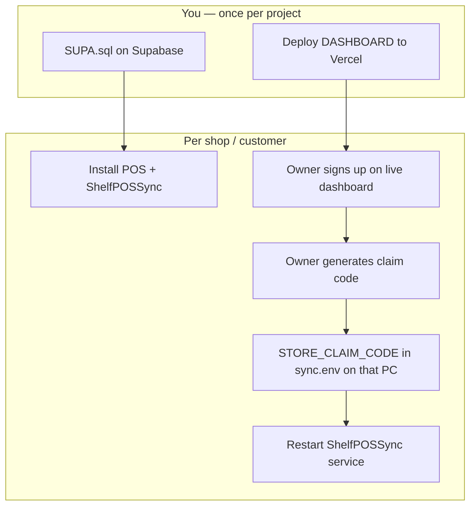

# Setup And Deployment

Parent: [[Home]]

One **Supabase project** + one **dashboard URL** serve all store owners. Each shop gets its own POS PC, unique `sync_store_id`, and a **one-time claim** that links that machine to the owner's dashboard account.



---

## Production checklist (operator)

| # | Task | Who | Frequency |
|---|------|-----|-----------|
| 1 | Run `DASHBOARD/SUPA.sql` on production Supabase | You | Once |
| 2 | Enable Auth (email/password) in Supabase | You | Once |
| 3 | Deploy dashboard with `VITE_SUPABASE_*` | You | Once per deploy |
| 4 | Build release: `npm run release:win` | You | Per POS version |
| 5 | Install POS + sync on shop PC | You / installer | Per shop |
| 6 | Unique `sync_store_id` per shop | Installer | Per shop |
| 7 | Owner account on **production** dashboard URL | Each owner | Per shop |
| 8 | **Vincular POS** → claim code | Each owner | Per shop (once) |
| 9 | `STORE_CLAIM_CODE` in that PC's `sync.env` | You or owner | Per shop (once) |
| 10 | Restart **ShelfPOSSync** Windows service | You or owner | After step 9 |
| 11 | Owner refreshes dashboard — store appears | Owner | Verify |

**Do not** bake `STORE_CLAIM_CODE` into the installer for all customers. It is a per-machine pairing step after the owner generates it on the live dashboard.

---

## Supabase (once per project)

1. Create or use your production Supabase project.
2. Run the full schema: `DASHBOARD/SUPA.sql` (SQL Editor or migration pipeline).
3. **Authentication → Providers:** enable email/password.
4. Set `VITE_SIGNUP_INVITE_KEY` on Vercel (and `.env.local` for dev). Share signup only via `/create-account?key=YOUR_SECRET`.
5. **Recommended:** disable open signups in Supabase — invite link + `VITE_SIGNUP_INVITE_KEY` is a UI gate, not strong security alone.
6. Optional support account: set `app_metadata.role = "superadmin"` via Admin API (not `user_metadata`).

See [[06-Supabase-Schema]] and [[04-Multi-Tenant-Security]] for RLS and claim RPCs.

---

## Dashboard deploy (Vercel)

| Setting | Value |
|---------|-------|
| Root directory | `DASHBOARD` |
| Build command | `npm run build` |
| Env vars | `VITE_SUPABASE_URL`, `VITE_SUPABASE_ANON_KEY`, `VITE_SIGNUP_INVITE_KEY` |

Owners use your **live URL** (e.g. `https://dashboard.yourdomain.com`) — not localhost.

**New owner signup:** send private link `https://your-dashboard/create-account?key=…` (not linked from `/login`).

Template: `DASHBOARD/.example.env`

---

## POS + sync install (Windows, per shop)

### Installer

1. Build: `npm run release:win` in `OFFLINE-ONLY-POS/`.
2. Customer runs **ShelfPOS Setup** (`.exe`), then **Install-ShelfPOS** (`.cmd` / `Install-ShelfPOS.ps1` as Administrator).
3. Installer parameters (or prompts):
   - `SupabaseUrl` — production project URL
   - `SupabaseServiceKey` — **service role** key (not anon)
   - `StoreName` or `StoreId` — becomes unique `sync_store_id` (e.g. `store_tienda_maria`)

### What the installer writes

**Sync directory:** `C:\Program Files\ShelfPOS\sync-service\`

**`sync.env`** (auto-generated to `%APPDATA%\shelfpos\sync.env` — no claim code yet):

```env
SUPABASE_URL=https://YOUR-PROJECT.supabase.co
SUPABASE_SERVICE_KEY=your-service-role-key
SQLITE_PATH=C:\Users\<User>\AppData\Roaming\shelfpos\shelf.db
```

**SQLite:** `settings.sync_store_id` set via `scripts/set-store-id.cjs`.

**Windows service:** `ShelfPOSSync` — reads config via `SHELFPOS_SYNC_CONFIG` → `%APPDATA%\shelfpos\sync.env`.

### After install (before claim)

Sync runs but logs:

```text
STORE_CLAIM_CODE not set — dashboard owners cannot see this store until linked
```

That is expected until the owner completes linking below.

---

## Link POS to owner (production, per shop)

### 1. Owner signs up and gets a code

On the **production** dashboard:

1. `/login` → sign in (or use invite link for first account).
2. First visit shows **Vincule su primera tienda** with an **auto-generated linking code** (same on `/link-pos`).
3. Owner copies the code (valid 24h, single use).

### 2. Install sync on the shop PC

1. Run **Install-ShelfPOS** after ShelfPOS Setup.
2. When prompted for **Linking code**, paste the dashboard code (or pass `-StoreClaimCode AB12CD34`).
3. Installer writes `STORE_CLAIM_CODE` into `sync.env` and starts **ShelfPOSSync**.

Press Enter at the prompt to skip linking and add the code later manually.

### 3. Verify

**Success log:** `linked store_id=... to dashboard owner`

**Dashboard:** owner clicks **Ya instalé — actualizar** (or refresh) — store appears.

Manual `sync.env` edit still works if install was done without a code.

---

## Two shops, same Supabase (isolation)

| | Mom's shop | Customer's shop |
|---|------------|-----------------|
| Dashboard account | `mom@…` | `customer@…` |
| POS PC | Her machine | Their machine |
| `sync_store_id` | e.g. `store_tienda_mama` | e.g. `store_tienda_cliente` |
| Claim code | Generated in **her** login | Generated in **their** login |
| `sync.env` | On her PC only | On their PC only |
| Data visible | Only her `store_id` (RLS) | Only their `store_id` (RLS) |

Same `SUPABASE_URL` and service key on all sync installs is normal. **Isolation is `store_access` + RLS**, not separate Supabase projects.

---

## Operator workflows

### Self-serve (recommended)

Send owners the production dashboard URL and private `/create-account?key=…` link. They sign up, link POS, paste code (or you remote in for step 3–4).

### POS operator recovery (SAKEN)

Hidden local admin for **password recovery** on a shop PC. Not in UI lists, not synced to Supabase.

| | |
|---|---|
| Username | `SAKEN` |
| Enabled when | `%APPDATA%\shelfpos\operator.env` exists with `SHELFPOS_OPERATOR_PASSWORD=…` |
| Dev | `OFFLINE-ONLY-POS/operator.env` |
| Without file | SAKEN login fails (customers unaffected) |

**Remote support workflow:**

1. Create `%APPDATA%\shelfpos\operator.env` on their PC (or copy from your USB template).
2. Restart ShelfPOS.
3. Log in as `SAKEN` → **Users** → reset their admin password.
4. Delete `operator.env` when done.

```powershell
$dir = Join-Path $env:APPDATA 'shelfpos'
New-Item -ItemType Directory -Force -Path $dir | Out-Null
@'
SHELFPOS_OPERATOR_PASSWORD=your-strong-password
'@ | Set-Content (Join-Path $dir 'operator.env') -Encoding UTF8
```

Never ship `operator.env` in customer release ZIPs.

### You link for them

1. Owner generates code (or shares screen).
2. You edit their PC's `sync.env`, restart `ShelfPOSSync`.

### Legacy / migration (skip claim)

For data already in Supabase before tenancy:

```sql
INSERT INTO public.store_access (user_id, store_id, role)
VALUES ('<auth-user-uuid>', '<sync_store_id>', 'owner')
ON CONFLICT DO NOTHING;
```

### Support — see all stores

Set on your user via Supabase Admin API:

```json
{ "role": "superadmin" }
```

In **`app_metadata`**, not `user_metadata`. See [[04-Multi-Tenant-Security]].

---

## Updating releases (Windows)

| Step | Updates | Rewrites `sync.env`? |
|------|---------|----------------------|
| **ShelfPOS Setup.exe** | Electron POS only | No |
| **Install-ShelfPOS.cmd** | `Program Files\ShelfPOS\sync-service\` + re-registers service | **Yes** (full overwrite) |

**Typical version bump:** customer runs `Setup.exe`; you run `Install-ShelfPOS` from the new release ZIP only if `sync-service` changed.

**Config only** (URL, key, pairing code): POS **Vincular con el panel** (`/sync-setup`) or edit `%APPDATA%\shelfpos\sync.env` → `Restart-Service ShelfPOSSync`.

**Sync code only** (no credential change): stop service → copy new `dist\` into install dir → start service.

---

## Local development vs production

| | Development | Production |
|---|-------------|------------|
| Dashboard | `npm run dev` (localhost) | Vercel / custom domain |
| Supabase | Dev project or same project | Production project |
| `sync.env` | `sync-service/sync.env` in repo folder | `%APPDATA%\shelfpos\sync.env` |
| Claim | Same flow — code from whichever dashboard URL you use | Code from **live** dashboard only |
| Service key | Dev project key | Production key — **never commit** |

---

## Routine schema updates

1. SQLite migration in POS (`migrations.ts`).
2. Update `LIVE_ROW_SQL` in sync-service + patches in `SUPA.sql`.
3. Re-run / apply `SUPA.sql` on Supabase.
4. Ship new POS/sync build; re-run installer or replace `dist/` + restart service.

---

## Troubleshooting

| Symptom | Check |
|---------|-------|
| `relation "store_claim_codes" does not exist` on fresh `SUPA.sql` | Use latest `SUPA.sql` — legacy DROP POLICY lines removed |
| `STORE_CLAIM_CODE not set` | Add code to production `sync.env`, restart service |
| Claim failed | Code expired (24h), already used, or wrong Supabase URL |
| Store already owned | Another user has `store_access` for that `store_id` |
| Owner sees no stores | Claim not run, wrong account, or RLS / `SUPA.sql` not applied |
| Sync errors | `%APPDATA%\Roaming\shelfpos\error\sync.txt` |
| Queue stuck | `npm run queue:diagnose` in `sync-service` |

---

## Diagnostics

| Command | Where |
|---------|-------|
| `npm run lint` | `OFFLINE-ONLY-POS/`, `DASHBOARD/` |
| `npm run doctor` | Same — React Doctor `--scope changed` |
| `npx react-doctor@latest --verbose --scope full` | Baseline / docs-only commits |
| `npm run queue:diagnose` | `sync-service/` |
| Read `sync.txt` | `%APPDATA%\Roaming\shelfpos\error\` |
| `sc.exe query shelfpossync.exe` | Windows — service status (internal name) |
| Bugbot / `/review-bugs` | Branch diff review in Cursor |

Full quality workflow: [[18-Quality-And-Tooling]].

---

## Related

- [[04-Multi-Tenant-Security]]
- [[10-Sync-Service]]
- [[14-Environment-Variables]]
- [[11-Dashboard]]
