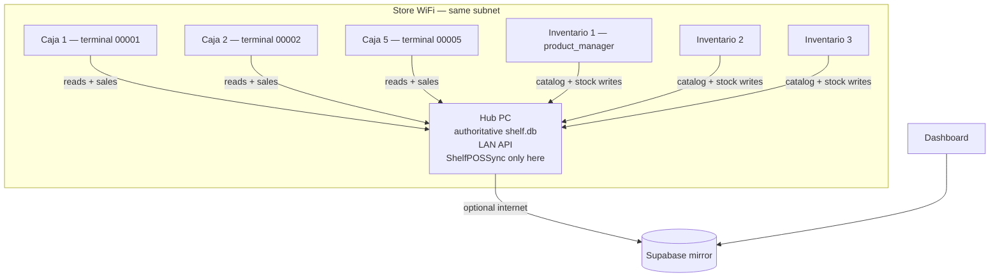

# Multi-store hub architecture (LAN)

Parent: [[Home]]  
Related: [[21-Multi-Store-Hub-TODO]], [[02-Architecture]], [[10-Sync-Service]], [[15-Setup-And-Deployment]]

> **Status:** Design approved in principle — **not implemented**.  
> **Context:** One physical tienda with multiple PCs (e.g. 5 checkout + 3 inventory), WiFi-only LAN, importer network proof-of-quality.

## Problem statement

Today ShelfPOS is **one PC = one island**:

- Local SQLite at `%APPDATA%\shelfpos\shelf.db`
- Optional cloud mirror via `ShelfPOSSync` (one `sync_store_id` per install)
- Installer can create **separate** `store_id` per register (`store_leo_bazaar_register_1`)

For a flagship store with **8 PCs** we need:

- **One** shared product catalog and stock pool
- **Five** independent checkout terminals (cash drawers, cierres)
- **Three** inventory workstations (no checkout)
- **WiFi** LAN (no Ethernet)
- **Checkout keeps selling** when hub is briefly unreachable (~10% WiFi blips)
- **One** `sync_store_id` and **one** `ShelfPOSSync` on the hub
- Dashboard: per-terminal **and** store-wide reporting

This is **not** Walmart-scale (hundreds of lanes). It is **one store, many workstations** — the right pattern for the importer’s owned tiendas.

## Actors and naming

| Concept | Example | Stored where |
|---------|---------|--------------|
| Physical store | Leo Bazaar | Dashboard `display_name` |
| `sync_store_id` | `store_leo_bazaar` | Hub settings → Supabase |
| Hub PC | Reserved IP / mDNS | Installer “Store server” |
| Checkout terminal | Caja 3 → `terminal_code` `00003` | Each checkout client |
| Inventory workstation | Inventario 2 | Client, no `terminal_code` |
| License | 1 JWT per machine (`machine_id`) | Each PC |

**Rule:** The **hub** owns the store name in cloud. Registers are **terminals under one store**, not `store_*_register_N` rows.

## Topology

## Install profiles

| Profile | PCs | Sync service | Sells? | Roles |
|---------|-----|--------------|--------|-------|
| `store_server` | 1 hub | Yes | No | Service + admin break-glass |
| `store_client_checkout` | 5 | No | Yes | `sales` |
| `store_client_inventory` | 3 | No | No | `product_manager`, `admin` |

Same Electron binary; installer + config choose profile.

## WiFi constraints

- **DHCP reservation** for hub IP on store router (existing or purchased).
- **No SQLite on SMB/NAS share** — corruption risk.
- Clients use **short HTTP timeouts + retries**.
- Optional **mDNS** (`shelfdpos-hub.local`) for discovery.
- Checkout maintains a **local product cache** (barcode, price, tax, last-known stock).

## Hub online — happy path

### Checkout

1. Scan → **local cache** (instant UI).
2. Pay → **POST sale to hub** in one transaction (stock check, sale insert, sync_queue).
3. Hub returns consecutivo / clave; client prints receipt.
4. Hub enqueues `sync_queue` for cloud mirror.

### Inventory

1. All catalog and stock writes go to **hub only**.
2. Receive shipment (PDF / CSV / eFactura) processed on hub.
3. **Admin beats product_manager** on conflict; all edits **audit logged**.

## Hub offline — checkout resilience

User requirement: **lanes keep selling** during short outages.

### Checkout client

| Phase | Behavior |
|-------|----------|
| Hub up | Authoritative stock + sale numbering on hub |
| Hub down | Sale → **local outbox** + cache prices; indicator “modo local / pendiente sync” |
| Hub returns | **Replay outbox** FIFO; hub applies stock rules |

**Oversell risk:** cache stock is stale. On replay failure (`stock >= qty` fails) → **exception queue** for admin (refund / adjust / force) + audit `sale_replay_conflict`.

### Inventory client

| Phase | Behavior |
|-------|----------|
| Hub up | Normal writes |
| Hub down | **Block writes** (or queue with “pendiente”); read-only browse from cache |

Inventory is not customer-facing; stricter than checkout.

### Cierre

- **Per terminal** — 5 independent cierres, tied to `terminal_code`.
- **Recommend:** cierre **requires hub** (manager can wait). Offline sale replay is OK; closing books on dead hub is edge case / paper contingency.

## Cloud and dashboard

- **One** `sync_store_id` per physical store.
- **ShelfPOSSync** runs **only on hub** (reads hub’s `shelf.db`).
- Every sale/cierre row carries **`terminal_code`** for drill-down.
- Dashboard filters: store rollup + per-terminal views.

## Catalog conflict policy

- Default: last write wins with **role rank** — `admin` > `product_manager`.
- Every product mutation → `audit_log` (already in sync tables).
- v1: no live “locked by user X” unless needed later.

## Relationship to importer network (future)

This hub design is **per physical store**. The wider network play (importer HQ catalog push, many client tiendas) is a **separate layer** on top of cloud:

- Flagship stores: hub architecture (this doc).
- Small client tiendas: may stay **standalone** 1–2 PC + sync until HQ catalog push exists.

See business context in [[21-Multi-Store-Hub-TODO#Phase 0 — flagship proof]].

## What we are not building here

- SQLite over WiFi file share
- Eight independent DBs with the same `sync_store_id` (ID collision in Supabase)
- Cloud sync as real-time LAN stock (5s poll is not lane-grade)
- Walmart-scale lane clustering

## Canonical code today (pre-hub)

| Concern | Path |
|---------|------|
| Local DB | `OFFLINE-ONLY-POS/src/main/db/index.ts` → `getDb()` |
| Terminal code setting | `SETTING_KEYS.terminalCode` in `settings.ts` |
| Consecutivo (tipo 04 tiquete) | `OFFLINE-ONLY-POS/src/main/ipc/sales.ts` → `nextConsecutivo()` |
| Sync tables | `OFFLINE-ONLY-POS/src/main/db/repos/syncQueue.ts` |
| Per-register installer naming | `OFFLINE-ONLY-POS/scripts/install-shelfpos.ps1` |
| Stock race safety | `WHERE stock >= ?` pattern in sales/products repos |

## Related decisions

When implementation starts, add ADRs for:

- Hub as SQLite authority vs future Postgres (defer Postgres unless >40 lanes)
- Offline outbox replay semantics
- Hub dedicated PC vs co-located with inventory
