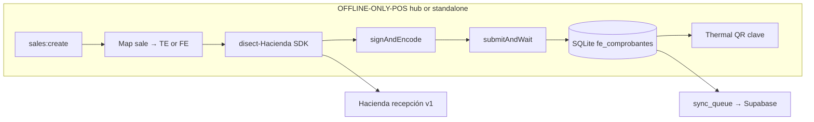

# Hacienda factura electrónica — architecture

Parent: [[Home]]  
Related: [[25-Regimenes-Tributarios-Bazaar]], [[24-Tax-Compliance]], [[13-Factura-PDF]], `disect-Hacienda/`

> **Status:** ShelfPOS prints thermal receipts and **layout PDFs**; it does **not** yet submit comprobantes to TRIBU-CR.  
> **Toolkit:** `disect-Hacienda/` — fork/vendor of [hacienda-cr](https://github.com/DojoCodingLabs/hacienda-cr) (SDK + CLI + MCP, API v4.4).

## Goal

Enable **Régimen Tradicional** (and other non-RTS obligados) to emit **valid v4.4 electronic comprobantes** from ShelfPOS, integrated with checkout, returns, and supplier receiving.

**Not in scope for v1:** Régimen de Tributación Simplificada (RTS) voluntary emission rules — see [§ RTS vs tradicional](#rts-vs-tradicional).

---

## Legal and regulatory context (research summary)

Sources consulted (2026):

| Source | URL |
|--------|-----|
| Anexos y Estructuras v4.4 (official XML) | [atv.hacienda.go.cr … v4.4 PDF](https://atv.hacienda.go.cr/ATV/ComprobanteElectronico/docs/esquemas/2024/v4.4/ANEXOS%20Y%20ESTRUCTURAS_V4.4.pdf) |
| Disposiciones técnicas DGT-R-000-2024 | [hacienda.go.cr PDF](https://www.hacienda.go.cr/docs/DGT-R-000-2024DisposicionesTecnicasDeComprobantesElectronicosCP.pdf) |
| Decreto marco 44739-H (RTS vs obligados) | Referenced in trade press; RTS **not** required to emit |

### Who must emit (non-simplificado)

| Régimen | Emit FE/TE? | Notes |
|---------|-------------|-------|
| **Tradicional** (IVA, renta habitual) | **Sí — obligatorio** | v4.4 mandatory from **1 Sep 2025** |
| **REBU / capital habitual** | **Sí** | Same electronic regime |
| **RTS (simplificado)** | **No** (voluntary) | If they opt in, exclusive electronic use; buyer may issue FEC |

### v4.4 highlights affecting POS

- **CIIU actividad económica** on comprobante — mandatory (from Oct 2025 per trade summaries).
- **CABYS** 13 digits per line — mandatory on goods/services.
- **Medios de pago** expanded (e.g. SINPE Móvil) in v4.4.
- **REP** (Recibo Electrónico de Pago) — new doc type `07` for credit invoices / state payments.
- **Receptor types** expanded (extranjero no domiciliado `05`, no contribuyente `06`).
- **Situación clave** `3` = sin internet — relevant for offline POS replay.
- Comprobante **without Hacienda acceptance has no fiscal effect**.

### Emisor-receptor confirmation (purchases)

When the store **receives** FE from suppliers (importer invoices), as **receptor electrónico** they must send **Mensaje Receptor** (accept/reject) within **8 business days** from the first day of the month following the transaction (Art. 10 DGT-R-000-2024). ShelfPOS supplier receive flow should eventually support this — not checkout v1.

---

## ShelfPOS today vs required

| Capability | Today | Required for compliance |
|------------|-------|-------------------------|
| Sale consecutivo | Local `branch`+`terminal`+`04`+seq in `sales.ts` | Must match **clave numérica** 50 digits + XML submission |
| Document type | Hardcoded `04` tiquete in consecutivo | **TE** (B2C) vs **FE** (identified B2B/B2C with cédula) per sale |
| Product codes | Internal barcode | **CABYS** per line (catalog field + validation) |
| Emisor data | Settings (nombre, cédula, etc.) | XML `Emisor` + `codigoActividad` CIIU |
| Tax | `tax_category: standard` 13% | Line IVA + `ResumenFactura` per v4.4 |
| PDF | Layout factura PDF ([[13-Factura-PDF]]) | **Not** substitute for XML — PDF is customer copy only |
| Signing | None | XAdES-EPES with `.p12` + TRIBU-CR crypto password |
| API | None | OAuth2 ROPC → recepción v1 → poll status |
| Returns | Local return flow | **Nota de Crédito** `03` linked to original clave |
| Supplier import | PDF/XLSX/eFactura → stock | Inbound FE parsing + optional **Mensaje Receptor** |

---

## `disect-Hacienda` inventory (repo review)

Monorepo at `disect-Hacienda/` (pnpm workspaces):

| Package | Purpose |
|---------|---------|
| `shared/` | Zod schemas, constants (document types, payment methods, CABYS helpers, provinces) |
| `packages/sdk/` | `HaciendaClient`, XML builders, tax math, XAdES signing, HTTP client, sequences |
| `packages/cli/` | `hacienda` CLI — auth, draft, validate, submit, status |
| `packages/mcp/` | MCP server for AI-assisted invoice testing |

### SDK capabilities already built

- **7 comprobante types** + Mensaje Receptor (`buildFacturaXml`, `buildTiqueteXml`, NC, ND, FEC, FEE, REP)
- **Clave numérica** `buildClave` / `parseClave` (50 digits, situación 1/2/3)
- **IVA** `calculateLineItemTotals`, `calculateInvoiceSummary`, `round5`
- **Signing** `signAndEncode` (P12 + XAdES-EPES)
- **Submit** `submitAndWait` with polling
- **Sequences** `getNextSequence` per branch/terminal/doc type
- **Taxpayer lookup** `lookupTaxpayer` (public API)
- **780+ tests** per README

### Integration approach for ShelfPOS

**Recommended packaging:**

1. Vendor `disect-Hacienda/packages/sdk` + `shared` into POS main process (similar to `sync-service/scripts/sync-vendor.mjs` pattern).
2. **Secrets never in SQLite:** `HACIENDA_PASSWORD`, `HACIENDA_P12_PIN` via DPAPI / env (reuse `dpapi-win` patterns).
3. **P12 file** path in settings; PIN in secure storage.
4. Run submission from **hub** in multi-store mode (single emisor, centralized sequences).

### Document choice at checkout (retail)

| Customer | Document | SDK builder | ShelfPOS trigger |
|----------|----------|-------------|------------------|
| Consumidor final | **Tiquete Electrónico** `04` | `buildTiqueteXml` | Default F9 pay, no cédula |
| Requires invoice | **Factura Electrónica** `01` | `buildFacturaXml` | Payment modal — cédula + nombre (exists partially) |
| Return | **Nota de Crédito** `03` | `buildNotaCreditoXml` | Return flow links `clave` original |
| Supplier purchase (RTS vendor) | **FEC** `05` | `buildFacturaCompraXml` | Optional later for importer receipts |

### Offline and hub alignment

| Scenario | Hacienda `Situation` | ShelfPOS behavior |
|----------|---------------------|-------------------|
| Online sale | `1` Normal | Submit before or immediately after print |
| Hub/LAN up, internet down | `3` Sin internet | Queue signed XML locally; submit when internet returns |
| Checkout outbox replay | `1` after delay | Use **emission date** rules per anexos — may need contingency flow |

Clave situación `3` is designed for this; confirm emission date vs transmission date in implementation.

### Credentials checklist (per store / emisor)

1. Inscripción activa en TRIBU-CR / ATV
2. Usuario API + contraseña (OAuth2 ROPC) — `HACIENDA_PASSWORD`
3. Certificado de firma `.p12` + PIN — `HACIENDA_P12_PIN`
4. Actividad económica CIIU principal (+ secundarias si aplica)
5. Sucursal `001` + terminals `00001`…`00005` registered in Hacienda / internal policy
6. Sandbox (`rut-stag`) testing before production (`rut`)

### Environments (`disect-Hacienda`)

| Env | API base | IDP |
|-----|----------|-----|
| sandbox | `…/recepcion-sandbox/v1/` | `rut-stag` / `api-stag` |
| production | `…/recepcion/v1/` | `rut` / `api-prod` |

---

## Data model additions (SQLite — design)

New tables (names tentative):

| Table | Purpose |
|-------|---------|
| `fe_comprobantes` | clave, tipo, sale_id, xml path, status, hacienda_status, rejection_reason |
| `fe_sequences` | branch, terminal, doc_type, last_seq (or use SDK sequence store on hub) |
| `products.cabys` | CABYS code per product (required before electronic sale) |
| `settings` | `codigo_actividad`, `hacienda_environment`, p12 path, emisor address fields |

Extend `sales`:

- `fe_clave`, `fe_tipo`, `fe_status` (nullable until submitted)
- Keep existing `consecutivo` aligned with `numeroConsecutivo` in XML

---

## Security

- P12 and API password: **DPAPI** on Windows (never sync to Supabase).
- Sync mirror: store **clave + status + tipo** only — not XML secrets.
- Audit: `fe_submitted`, `fe_accepted`, `fe_rejected` in `audit_log`.

---

## RTS vs tradicional

ShelfPOS target customers for **full electronic emission** are **non-RTS obligados** (importer’s jurídicas, tradicional retailers).

RTS shops in her network may keep **paper / simplified** flows unless voluntarily registered — do not force FE pipeline on RTS-only installs (settings flag `tax_regime: traditional | rts`).

---

## Official references (bookmark)

- XML schemas v4.4: https://atv.hacienda.go.cr/ATV/ComprobanteElectronico/docs/esquemas/2024/v4.4/
- CRLibre community docs: https://github.com/CRLibre/API_Hacienda
- `disect-Hacienda/README.md` — SDK examples and CLI reference

---

## Related ShelfPOS code

| Piece | Path |
|-------|------|
| Consecutivo (tipo 04) | `OFFLINE-ONLY-POS/src/main/ipc/sales.ts` |
| Emisor settings | `OFFLINE-ONLY-POS/src/main/db/repos/settings.ts`, `SettingsSections.tsx` |
| Payment customer / cédula | `PaymentInvoiceCustomerSection`, `buildPaymentCustomer` |
| Layout PDF (not XML) | `facturaPdf.ts`, [[13-Factura-PDF]] |
| Supplier receive | `productSupplierInvoicePdf.ts`, eFactura import |
