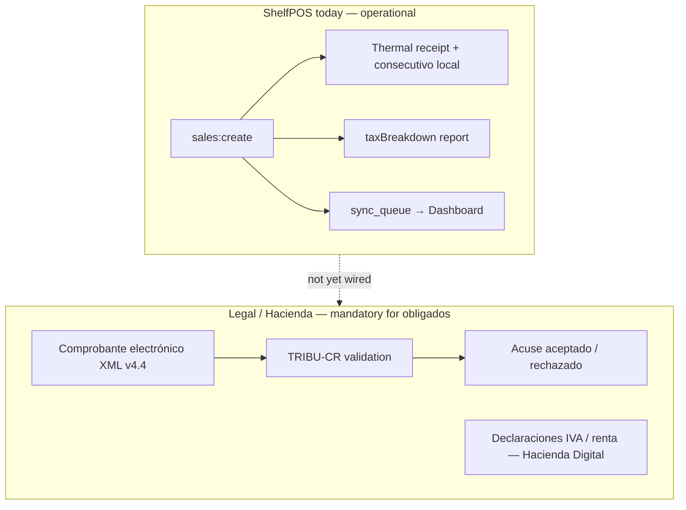
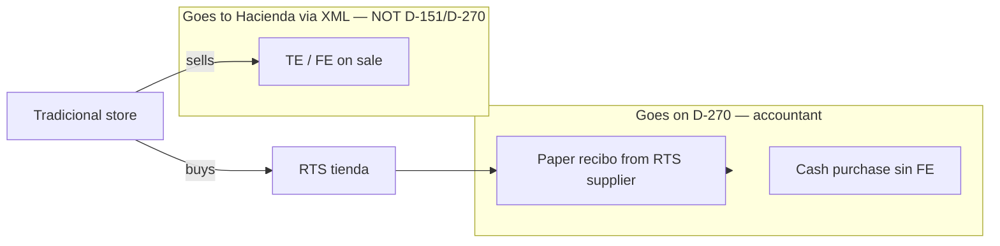
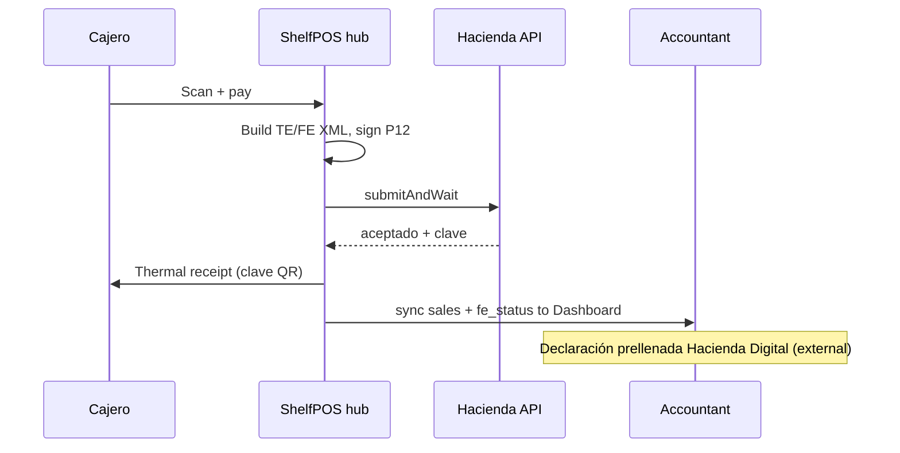

# Tax compliance (Costa Rica)

Parent: [[Home]]  
Related: [[22-Hacienda-Factura-Electronica-Architecture]], [[23-Hacienda-Factura-Electronica-TODO]], [[12-Reports-And-Exports]], [[13-Factura-PDF]]

> **Disclaimer:** This wiki explains how ShelfPOS relates to Costa Rican tax rules. It is **not legal or accounting advice**. Each store’s accountant / cédula jurídica status determines the exact obligation.

---

## Two layers of “compliance”



| Layer | What it proves | ShelfPOS status |
|-------|----------------|-----------------|
| **Electronic comprobante** | Sale happened with fiscal effect before Hacienda | **Not implemented** — see [[22-Hacienda-Factura-Electronica-Architecture]] |
| **Internal books** | IVA math, sales log, inventory, cierre | **Partial** — reports + SQLite; no D-104 export |
| **Customer paper** | Buyer has a receipt | **Yes** — thermal tiquete |
| **Layout PDF** | Grid invoice for B2B paperwork | **Yes** — [[13-Factura-PDF]] (not XML) |

A thermal receipt with a local consecutivo is **not** the same as a **Tiquete Electrónico** or **Factura Electrónica** accepted by Hacienda.

---

## Tax regimes (who owes what)

Costa Rica splits most small retailers into different **régimenes tributarios**. A bazaar (tienda minorista / bazar) is usually **comercio minorista** — often **RTS**, but importer-owned stores are typically **tradicional**.

**Full guide:** [[25-Regimenes-Tributarios-Bazaar]] — RTS vs tradicional vs REBU, comprobantes, importer network scenarios.

ShelfPOS stores `tax_regime` in settings (`simplificado` | `tradicional`):

| | **Régimen simplificado (RTS)** | **Régimen tradicional** |
|---|-------------------------------|-------------------------|
| **Typical profile** | Small bazaar, miscelánea, low volume on RTS list | Jurídica importer, flagship stores, larger revenue |
| **Emit FE/TE?** | **No** (voluntary if registered as e-emitter) | **Sí — obligatorio** |
| **IVA on sales** | No desglosa / no cobra IVA en caja (cuota fija RTS) | IVA 13% (y otras tarifas) en precios |
| **If buyer needs invoice** | Buyer may issue **FEC** (Factura Electrónica de Compra) | Seller emits **FE** or **TE** |
| **ShelfPOS default** | `tax_regime = simplificado` (migration default) | Must be configured + Hacienda pipeline |

**Importer network context:** client tiendas often **RTS**; importer and flagship stores **tradicional + electronic comprobantes**.

Official framing: Decreto 44739-H; RTS voluntary e-invoicing — [Siempre al Día RTS summary](https://siemprealdia.co/costa-rica/impuestos/factura-electronica-para-el-regimen-simplificado/).

---

## IVA — how ShelfPOS calculates it

### Price model

- Product **prices are IVA-inclusive** at the shelf (typical CR retail).
- On checkout, line totals are `quantity × unitPrice − discounts` — **no IVA is added at the register**.
- Under **tradicional**, IVA is **reverse-calculated** for display and reports:

```
base = gross / (1 + rate)
iva  = gross − base
```

Implementation: `taxBreakdown()` in `OFFLINE-ONLY-POS/src/main/db/repos/reports.ts`.

### Rates today

| Setting | Default | Used |
|---------|---------|------|
| `iva_rate_standard` | `13` | **Yes** — all products (`ivaRateFor()` ignores category) |
| `iva_rate_canasta_basica` | `1` | **Legacy** — migration v8 forced all products to `standard` |
| `tax_category` on products | `standard` only | Snapshot on `sale_items.tax_category` |

Hacienda v4.4 supports 0%, 1%, 2%, 4%, 8%, 13% per line (`disect-Hacienda` SDK). ShelfPOS will need per-product or per-line tarifa when electronic emission ships.

### Régimen simplificado vs tradicional in the UI

| Behavior | Simplificado | Tradicional |
|----------|--------------|-------------|
| Receipt IVA breakdown | Hidden (`taxBreakdown` not passed today in `sales.ts`) | Intended: base + IVA rows on thermal |
| `taxBreakdown` report | Informational (“no se cobra IVA en caja”) | Used for accountant / dashboard |
| Settings UI | Shows regime label **read-only** | Same — **no in-app toggle yet** to switch regime |

Locale hint (`es.json`): *“En régimen simplificado no se cobra ni se desglosa el IVA.”*

**Gap:** `tax_regime` is stored but changing it requires DB/accountant setup — not exposed as a safe admin action yet.

---

## Document numbering (consecutivo)

Each sale gets a local **`consecutivo`** string:

```
[sucursal 3][terminal 5][tipo doc 2][secuencia 10]
```

Example structure from `nextConsecutivo()` in `sales.ts`:

- `branch_code` → 3 digits (default `001`)
- `terminal_code` → 5 digits (default `00001`)
- **tipo doc** → hardcoded `04` (tiquete)
- `consecutivo_next` → 10-digit sequence, incremented per sale

Settings: Admin → Impuestos y consecutivo (`SettingsTaxSection`).

### vs Hacienda clave numérica

| | ShelfPOS today | Hacienda v4.4 |
|---|----------------|---------------|
| Length | 20 digits (internal) | **50 digits** clave + XML |
| Uniqueness | Per machine SQLite | Nacional, tied to emisor + tipo + situación |
| Validation | None | TRIBU-CR accept/reject |

When electronic invoicing is integrated, consecutivo and `buildClave()` must stay **in sync** per terminal — especially in [[20-Multi-Store-Hub-Architecture]] (hub owns sequences).

---

## Comprobante types at checkout (target state)

| Customer | Legal document | When |
|----------|----------------|------|
| Consumidor final | **Tiquete Electrónico (04)** | Default F9 pay, no cédula |
| Needs tax credit / formal invoice | **Factura Electrónica (01)** | Payment modal — nombre + cédula + email |
| Devolución | **Nota de Crédito (03)** | Return flow, references original clave |
| Compra a proveedor RTS sin FE | **FEC (05)** | Buyer documents purchase (store may only give paper) |

ShelfPOS today: always prints a **thermal tiquete** layout; captures optional **customer** fields for future FE; exports **layout PDF** — none submitted to Hacienda.

---

## Emisor data (settings)

Admin → **Datos del emisor** maps to future XML `Emisor` and receipt header:

| Setting key | Purpose |
|-------------|---------|
| `store_legal_name` | Razón social |
| `store_id_type` / `store_id` | Cédula física / jurídica / DIMEX / NITE |
| `store_activity_code` | CIIU — **obligatory on v4.4 comprobantes** |
| `store_province`, `store_canton`, `store_district`, `store_address` | Ubicación |
| `store_phone`, `store_email` | Contacto |
| `branch_code`, `terminal_code` | Sucursal y caja |

`emisorFromSettings()` in `printTemplates.ts` feeds receipts and factura PDF.

---

## Sales → audit trail

Each sale records:

- `sales`: subtotal, discount_total, total, consecutivo, optional customer fields
- `sale_items`: unit_price, line_total, `tax_category` snapshot, barcode snapshot
- `sale_payments`: cash / card / sinpe (authoritative for payment method)
- `audit_log`: price overrides, discounts, cart tab discard, etc.

Synced to Supabase for dashboard — **not** a substitute for Hacienda’s comprobante registry.

---

## Cierre de caja (operational compliance)

**Cierre** is **not** a Hacienda filing. It is **internal control**:

- Count cash per terminal vs expected
- Close shift, audit discrepancies
- Discard open cart tabs (audited)

Per-terminal cierre in multi-store design: [[20-Multi-Store-Hub-Architecture]].

Supports fraud prevention and reconciliation; accountant may use totals alongside electronic comprobantes.

---

## Reports useful for accountants

| Report | Path | Use |
|--------|------|-----|
| **Desglose de IVA** | `taxBreakdown` | Base + IVA by period |
| **Transaction log** | `transactionLog` | Every sale + consecutivo |
| **Itemized sales** | `itemizedSales` | Line detail |
| **Summary** | `summary` | Revenue by day |
| **Dashboard KPI** | `taxSummary` | Month-to-date taxable sales |

POS: Admin → Reportes. Dashboard: same types from Supabase mirror.

**Not built:** D-104 pre-fill, declaración export, libro de ventas XML for accountant software.

---

## D-151 / D-270 — informational return (non-electronic transactions)

**Not a POS report.** ShelfPOS does not file this. The **accountant** files it in **TRIBU-CR** (formerly Declar@7 for annual D-151).

### What D-151 was

**D-151** — *Declaración informativa de clientes, proveedores y gastos específicos* (also “Resumen de clientes, proveedores y gastos específicos”).

| Property | Detail |
|----------|--------|
| **Purpose** | Tell Hacienda about **economic operations not backed by electronic comprobantes** |
| **Type** | **Informational only** — no tax payment with the form itself |
| **Used for** | Cross-checking (“cruce”) against what other taxpayers reported |
| **Old cadence** | **Annual** (deadline typically **28 February** following the fiscal year) |

### What gets reported

Only transactions **without** valid electronic invoice XML — for example:

| Situation | Example in bazaar network |
|-----------|---------------------------|
| **Purchases from RTS** suppliers | Buy from small tienda that gives paper/recibo only |
| **Sales to someone** without TE/FE | Rare if you emit electronically; relevant for RTS sellers’ buyers |
| **Specific expenses** | Professional services, rent, commissions, interest (above thresholds) — codes SP, A, M, I |

**Not included:** operations already covered by **FE/TE** in Hacienda’s system, imports/exports, amounts already in retentions (D-150).

Operation codes (classic D-151):

| Code | Meaning |
|------|---------|
| **V** | Sales of goods/services to clients |
| **C** | Purchases from suppliers |
| **SP** | Professional services expense |
| **A** | Rent expense |
| **M** | Commissions |
| **I** | Interest (with exceptions) |

Amounts are typically **net** (without IVA shown separately on the reported figure), per Hacienda instructions for each period.

### Who must file

Broadly: **persons físicas or jurídicas** (public or private) that had reportable domestic purchases/sales above **umbrales** (thresholds) with the same counterparty — exact amounts change by year; accountant applies current rules.

### D-151 → D-270 (2026 change)

Per **Resolución MH-DGT-RES-0055-2025** (Nov 2025):

| | **D-151** | **D-270** (successor) |
|---|-----------|------------------------|
| **Name** | Annual informative summary | *Informativa resumen **mensual**… no amparados en comprobante electrónico* |
| **Period** | Annual (last annual: fiscal **2025**) | **Monthly** from **Jan 2026** |
| **Deadline** | ~28 Feb (annual) | **First 10 calendar days** of the following month |
| **Where** | TRIBU-CR (was Declar@7) | **TRIBU-CR** only |

Same core idea: report what **did not** go through electronic comprobantes — now **monthly** instead of once a year.

### Relevance to ShelfPOS / your network



| Actor | ShelfPOS role | D-151/D-270 role |
|-------|---------------|------------------|
| **Tradicional flagship** (TE/FE) | Sales → Hacienda XML | Report **purchases** from RTS/paper only |
| **RTS client tienda** | Thermal recibo | Its **buyers** (tradicional) may report purchases on D-270 |
| **Importer (tradicional)** | FE to shops | Shops get XML; importer sales usually **not** on buyer’s D-270 |

As more of the network emits **electronic** comprobantes, **less** should appear on D-270 — that is the point of factura electrónica + Hacienda Digital.

**ShelfPOS opportunity (future, accountant-facing):** export “transactions without clave” or “purchases marked non-electronic” to help populate D-270 — not built today.

Official context: [Deloitte — RES-0055-2025](https://www.deloitte.com/latam/es/services/tax/perspectives/cr-04nov25-administracion-tributaria-comprobantes-electronicos.html), [Siempre al Día — D-270](https://siemprealdia.co/costa-rica/impuestos/como-presentar-declaracion-d-270-en-tribu-cr/).

---

## Purchases and imports (inbound tax)

When the store **buys** from the importer (or any emisor electrónico):

1. Supplier sends **Factura Electrónica XML** (or paper if RTS).
2. As **receptor electrónico**, tradicional obligado must send **Mensaje Receptor** (aceptar/rechazar) within regulatory deadline (8 días hábiles desde inicio del mes siguiente — DGT-R-000-2024 Art. 10).
3. ShelfPOS **receive** flows today: supplier PDF, CSV, eFactura XLSX → stock + cost — **no XML / Mensaje Receptor**.

`disect-Hacienda` has `buildMensajeReceptorXml()` — see [[23-Hacienda-Factura-Electronica-TODO]] Phase 7.

---

## CABYS (upcoming requirement)

Hacienda v4.4 requires **CABYS** (13 digits) on every electronic invoice line — separate from barcode and from emisor `codigoActividad`.

**Full guide:** [[26-CABYS]] — catalog, 2025 version, bazaar workflow, ShelfPOS gaps.

- ShelfPOS products: **no `cabys` column yet**
- Import paths (eFactura, supplier PDF) do not map CABYS today
- Required before electronic emission — [[23-Hacienda-Factura-Electronica-TODO]] Phase 2

---

## Compliance checklist by store type

### RTS tienda (simplificado) — current ShelfPOS fit

- [x] Sell with thermal receipt
- [x] Track sales and inventory locally + dashboard
- [x] No IVA breakdown to customer
- [ ] Electronic emission (not required)
- [ ] If customer needs invoice → FEC is **buyer’s** job, not POS

### Tradicional tienda (target for importer flagship)

- [ ] `tax_regime = tradicional` (explicit setup)
- [ ] IVA breakdown on receipt (wire `taxBreakdown` in `sales.ts`)
- [ ] CABYS on all products
- [ ] Emisor settings complete + CIIU
- [ ] `.p12` + TRIBU-CR credentials on hub
- [ ] TE for most sales; FE when cédula captured
- [ ] NC on returns
- [ ] Mensaje Receptor on supplier FE
- [ ] Sandbox pilot → production

---

## End-to-end flow (target — tradicional + electronic)



Until this ships, accountants rely on **reports + manual** cross-check with Hacienda portal.

---

## Official references

| Document | URL |
|----------|-----|
| Anexos y estructuras v4.4 | https://atv.hacienda.go.cr/ATV/ComprobanteElectronico/docs/esquemas/2024/v4.4/ANEXOS%20Y%20ESTRUCTURAS_V4.4.pdf |
| Disposiciones técnicas DGT-R-000-2024 | https://www.hacienda.go.cr/docs/DGT-R-000-2024DisposicionesTecnicasDeComprobantesElectronicosCP.pdf |
| Toolkit in repo | `disect-Hacienda/README.md` |

---

## ShelfPOS code map

| Concern | Location |
|---------|----------|
| Tax regime + IVA settings | `src/main/db/repos/settings.ts` |
| Sale consecutivo | `src/main/ipc/sales.ts` → `nextConsecutivo()` |
| IVA report | `src/main/db/repos/reports.ts` → `taxBreakdown()` |
| Receipt template | `src/main/services/printTemplates.ts` |
| Emisor on receipt | `emisorFromSettings()` |
| Layout PDF (non-XML) | `src/main/services/facturaPdf.ts` |
| Customer on sale | `sales.customer_*` columns, payment modal |
| Default regime | `migrations.ts` v2 → `tax_regime = simplificado` |

---

## Related TODOs

- Electronic emission: [[23-Hacienda-Factura-Electronica-TODO]]
- Multi-terminal sequences: [[21-Multi-Store-Hub-TODO]] Phase 5
- Expose safe `tax_regime` change (admin + accountant acknowledgment) — add to [[23-Hacienda-Factura-Electronica-TODO]] or settings backlog
- Wire `taxBreakdown` into `buildReceiptLines` when `taxRegime === 'tradicional'`
