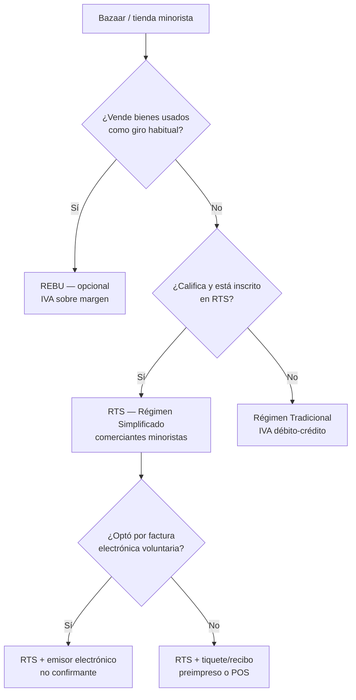
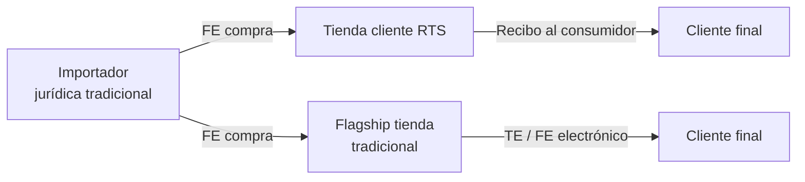

# Régimenes tributarios — bazaar / tienda minorista

Parent: [[Home]]  
Related: [[24-Tax-Compliance]], [[22-Hacienda-Factura-Electronica-Architecture]], [[23-Hacienda-Factura-Electronica-TODO]]

> **Disclaimer:** Only Hacienda and the store’s accountant can confirm which régimen applies. This page explains the **options a bazaar-style shop typically encounters** in Costa Rica — especially Chinese import retail (“bazar”) in the importer network context.

---

## What “régimen” means here

In Costa Rica, **régimen tributario** is how Hacienda classifies a business for **IVA** and **income tax** filing — not a ShelfPOS setting by itself.

A **bazaar** (tienda de variedades, bazar chino, miscelánea) is usually **comercio minorista**: selling goods to final consumers. That activity can fall under different régimens depending on **revenue**, **legal form** (persona física / jurídica), **what they sell** (new vs used), and **what the owner registered** at TRIBU-CR / ATV.

ShelfPOS stores a simplified flag: `tax_regime` = `simplificado` | `tradicional` — see [[24-Tax-Compliance#ShelfPOS mapping]].

---

## Which régimens matter for a bazaar?

| Régimen | Typical bazaar profile | Factura electrónica | Declaración principal |
|---------|------------------------|---------------------|------------------------|
| **RTS** (simplificado) | Small retail, low volume, activity on RTS list | **No obligatoria** | **D-105** (trimestral, cuota sobre compras) |
| **Tradicional** | Jurídica, larger sales, or outgrew RTS | **Obligatoria** (v4.4) | **D-104** (mensual, débito-crédito IVA) |
| **REBU** (bienes usados) | Second-hand / used goods reseller | **Obligatoria** (es régimen de IVA pleno) | D-104 + registro auxiliar compras/ventas |
| **RTS + emisor electrónico** (voluntary) | RTS shop that chose to emit XML | **Sí, exclusiva** (all comprobantes electronic) | D-105 + obligaciones de emisor |

**Rare for standard import bazaars:** Régimen Especial Agropecuario (REA), renta única, etc. — not covered here unless the store’s accountant says otherwise.

---

## 1. RTS — Régimen de Tributación Simplificada

**Best fit for:** many small bazaars, misceláneas, and “Chinese store” shops with **modest volume** that qualify for the simplified retail régimen.

### Who it targets

Created for **comerciantes minoristas y bares** — retail selling to consumers, including stores in conditioned premises or informal setups. Decreto reformas (e.g. 45209-H, 2025) still frame RTS around **listed economic activities** and **relatively low economic volume** vs régimen general.

Typical bazaar: shelves of imported housewares, tools, gifts, phone accessories — **new goods**, high SKU count, cash/card sales.

### How tax works (conceptually)

| Topic | RTS behavior |
|-------|----------------|
| **IVA** | Not calculated per sale at 13% on the register. Instead, a **simplified quota** tied to **purchases** and activity **factor** (D-105). |
| **IVA on receipt** | **No** breakdown to customer — prices are final shelf prices. |
| **Crédito fiscal** | Buyer on RTS **does not** use IVA crédito fiscal like tradicional. |
| **Income tax** | Simplified treatment under the same régimen framework (accountant handles). |
| **Records** | Lighter than full accounting; must keep **purchase documents** for possible audits. |

### What the customer gets at checkout

| Document | Required? |
|----------|-----------|
| Factura electrónica (FE/TE) | **No** — even if customer asks (Decreto 44739-H Art. 7 area) |
| Recibo / tiquete / comprobante preimpreso | **Yes** for normal sales — must include emisor id, buyer data if needed, description, date, etc. |
| ShelfPOS thermal receipt | Operational substitute — **not** a Hacienda XML comprobante unless shop opted into voluntary e-invoicing |

### When the **buyer** is tradicional (e.g. another business)

If an RTS bazaar sells to a **régimen tradicional** customer who needs fiscal proof:

- The **buyer** issues **Factura Electrónica de Compra (FEC)** using data the RTS seller provides (paper ticket, email, etc.).
- The RTS seller **does not** have to emit FE for that sale.

**Importer network angle:** small client tiendas (RTS) buying from the importer (tradicional) receive **FE** from the importer. When they **sell** to consumers, they give a **simple receipt** — not FE.

### Voluntary electronic invoicing on RTS

An RTS taxpayer **may register** as **emisor receptor electrónico no confirmante**:

- If they opt in → must emit **only** electronic comprobantes going forward (**exclusive**).
- They act as **non-confirming** emitter — different validation rules than full tradicional.
- ShelfPOS would need the full [[22-Hacienda-Factura-Electronica-Architecture]] pipeline + `tax_regime` clarity.

**Default ShelfPOS posture for RTS:** `tax_regime = simplificado` — matches no IVA breakdown on receipt ([[24-Tax-Compliance]]).

**Official summary:** [Factura electrónica para régimen simplificado](https://siemprealdia.co/costa-rica/impuestos/factura-electronica-para-el-regimen-simplificado/)

---

## 2. Régimen tradicional (general IVA)

**Best fit for:** importer’s **sociedad anónima / jurídica**, larger stores, chains, or any shop **not** on RTS (or that **graduated** out).

### How tax works

| Topic | Tradicional behavior |
|-------|---------------------|
| **IVA** | **13%** (and other tarifas: 1%, 2%, 4%, 8% on specific goods) on taxable sales |
| **Pricing** | Shelf prices usually **include IVA**; system reverse-calculates base + IVA for reports |
| **Crédito fiscal** | **Yes** — IVA paid on **purchases** (with valid FE) offsets IVA collected on sales |
| **Declaration** | **D-104** monthly (typical) |
| **Accounting** | Full books, detailed records |

### Comprobantes — mandatory electronic (v4.4)

| Sale type | Document |
|-----------|----------|
| Consumer final (most bazaar lane sales) | **Tiquete Electrónico (TE)** `04` |
| Customer with cédula needing invoice | **Factura Electrónica (FE)** `01` |
| Return | **Nota de Crédito (NC)** `03` |
| Purchase from non-emitter | **FEC** `05` (as buyer) |

Every comprobante: XML v4.4 → sign → TRIBU-CR **acceptance**. Without acceptance, **no fiscal effect**.

### Multi-checkout bazaars (importer flagship)

Tradicional jurídica with **5 cajas** must:

- One emisor (cédula jurídica), multiple **terminal_code** / sucursal
- Centralized or hub-based **consecutivo / clave** — [[20-Multi-Store-Hub-Architecture]]
- TE/FE on **every** taxable sale

**ShelfPOS target:** `tax_regime = tradicional` + Hacienda integration ([[23-Hacienda-Factura-Electronica-TODO]]).

---

## 3. REBU — Régimen Especial de Bienes Usados

**Best fit for:** bazaars whose **main business is reselling used goods** (second-hand electronics, tools, antiques) — **not** typical new-import variety stores.

### Key points

| Topic | REBU |
|-------|------|
| **Optional** | Voluntary inscription (D-140); **minimum 2 years** |
| **IVA base** | Often on **margin** (selling price − purchase cost), not full price — avoids double taxation |
| **E-invoicing** | **Still mandatory** — REBU is an IVA calculation régimen, not an exemption from FE/TE |
| **v4.4** | Special cases for buying from **non-contributors** (comprobante de compra) — see La Nación / Hacienda notes on used-goods dealers |

If a bazaar sells **only new imported goods**, REBU **does not apply**. Mixed store → accountant splits activities or picks primary régimen.

---

## 4. Cross-cutting: persona física vs jurídica

| | **Persona física** | **Persona jurídica** (S.A., S.R.L.) |
|---|-------------------|-------------------------------------|
| **Common in network** | Single-owner tienda | Importer, flagship stores, wholesalers |
| **Typical régimen** | Often RTS if small | Almost always **tradicional** |
| **Cédula on comprobante** | Cédula física `01` | Cédula jurídica `02` |
| **ShelfPOS emisor** | `store_id_type: fisica` | `store_id_type: juridica` |

Legal form does **not** automatically pick régimen — a jurídica could theoretically be on RTS only if law allows; in practice **importer operations are tradicional**.

---

## 5. Scenario matrix — importer network

| Actor | Likely régimen | Sells with | Buys from importer with |
|-------|----------------|------------|-------------------------|
| Small client bazaar | **RTS** | Recibo / tiquete POS | **FE** from importer |
| Importer (wholesale) | **Tradicional** | **FE** to shops | Import / supplier FE |
| Importer’s own flagship store | **Tradicional** | **TE/FE** electronic | Internal transfer / import (accountant) |
| Used-goods corner shop | **REBU** (+ tradicional IVA) | **TE/FE** electronic | FEC / special purchase docs |

---

## 6. How a bazaar **enters** or **leaves** a régimen

| Transition | Trigger (simplified) |
|------------|---------------------|
| **→ RTS** | Qualifying activity + within volume limits; voluntary inscription |
| **RTS → Tradicional** | Exceed thresholds, change activity, or voluntary exit (accountant + Hacienda) |
| **→ REBU** | Habitual used-goods resale; form D-140 before fiscal year |
| **RTS → electronic emitter** | Voluntary registration; then **exclusive** electronic comprobantes |

ShelfPOS does **not** file régimen changes — owner/accountant does via ATV / TRIBU-CR.

---

## 7. Comprobantes cheat sheet (at the register)

| Régimen | Consumer buys ₡3,000 goods | Business (tradicional) buys for resale |
|---------|---------------------------|--------------------------------------|
| **RTS** | Tiquete/recibo (paper or POS) | FEC emitted by **buyer** |
| **Tradicional** | **Tiquete Electrónico** XML | **Factura Electrónica** XML from seller |
| **RTS + voluntary e-emit** | TE XML (non-confirming) | Per registration rules — ask accountant |
| **REBU** | TE/FE XML (used good rules) | FE/FEC per transaction type |

---

## 8. ShelfPOS mapping

| Hacienda régimen | `settings.tax_regime` | Receipt IVA lines | Hacienda XML |
|------------------|----------------------|-------------------|--------------|
| RTS (default install) | `simplificado` | Hidden | Not required |
| Tradicional | `tradicional` | Should show (gap: not wired in `sales.ts` yet) | Required — [[23-Hacienda-Factura-Electronica-TODO]] |
| RTS voluntary e-emit | `simplificado` + feature flag (future) | Per XML | Required if registered |
| REBU | `tradicional` (recommended) + accountant flags | Special IVA base rules | Required |

**Important:** New installs default to `simplificado` in SQLite migration v2. A **tradicional** flagship must be switched explicitly (today: accountant + DB/settings — no safe admin toggle yet).

---

## 9. Choosing the right régimen (for owners)

Questions for the accountant — not for POS software alone:

1. ¿Estamos inscritos en **RTS** o en **régimen tradicional** según ATV?
2. ¿Ventas anuales / compras superan umbrales del simplificado?
3. ¿Persona física o jurídica?
4. ¿Giro 100% productos nuevos importados o también **usados** (REBU)?
5. ¿Clientes B2B exigen FE frecuentemente?
6. ¿El importador exige comprar solo con FEC/FE cruzada?

**For your competitive proof:** flagship importer stores should demonstrate **tradicional + TE/FE v4.4** end-to-end. Small network tiendas on **RTS** need **fast receipt + inventory**, not full Hacienda on every lane — unless they voluntarily register as e-emitters.

---

## 10. Official references

| Topic | Link |
|-------|------|
| RTS reform (comercio minorista) | [Decreto 45209-H summary (PwC)](https://www.pwc.com/ia/es/publicaciones/Noticias-Tax-Legal/Tax-and-legal-2025/Se-reforma-el-reglamento-del-Regimen-de-Tributacion-Simplificada.pdf) |
| RTS + factura electrónica | [Siempre al Día — RTS](https://siemprealdia.co/costa-rica/impuestos/factura-electronica-para-el-regimen-simplificado/) |
| E-invoicing by régimen | [Siempre al Día — requisitos por régimen](https://siemprealdia.co/costa-rica/impuestos/requisitos-para-emitir-facturas-electronicas-segun-regimen-tributario/) |
| Comprobantes electrónicos v4.4 | [Anexos Hacienda v4.4](https://atv.hacienda.go.cr/ATV/ComprobanteElectronico/docs/esquemas/2024/v4.4/ANEXOS%20Y%20ESTRUCTURAS_V4.4.pdf) |
| Ley IVA — REBU | [SCIJ — Ley 9635 / reglamento IVA](https://pgrweb.go.cr/scij/Busqueda/Normativa/Normas/nrm_CONSULTA_articulo.aspx?nBaseDato=1&nNorma=88953&nVersion=124733&param1=NRA) |

---

## Related wiki

- [[24-Tax-Compliance]] — IVA math, reports, two layers of compliance
- [[22-Hacienda-Factura-Electronica-Architecture]] — technical FE/TE pipeline
- [[20-Multi-Store-Hub-Architecture]] — multi-caja tradicional stores
