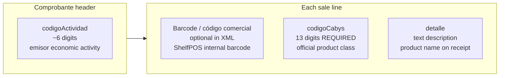
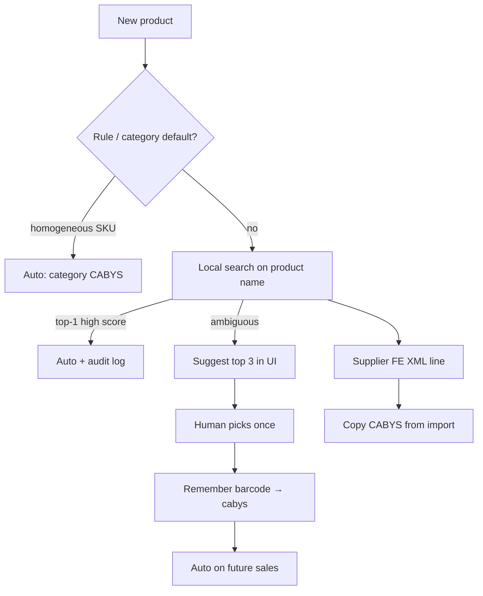

# CABYS — Catálogo de Bienes y Servicios

Parent: [[Home]]  
Related: [[22-Hacienda-Factura-Electronica-Architecture]], [[23-Hacienda-Factura-Electronica-TODO]], [[24-Tax-Compliance]], [[25-Regimenes-Tributarios-Bazaar]]

> **Short answer:** CABYS is Hacienda’s **official 13-digit product/service code** for each invoice line. It is **not** your barcode. Required on every **electronic** comprobante (TE/FE/NC). ShelfPOS does **not** store it yet.

---

## What CABYS is

**CABYS** (Catálogo de Bienes y Servicios) is a national catalog maintained by the **Banco Central de Costa Rica (BCCR)** with **Ministerio de Hacienda**.

| Property | Detail |
|----------|--------|
| **Purpose** | Classify what was sold for tax, statistics, and validation |
| **Structure** | Hierarchical: 1 digit → … → **13 digits** at product level |
| **Scale** | 10 top categories → 20,000+ specific codes |
| **Basis** | International CPC classification + local CR needs |
| **Where used** | XML field **Código de Producto/Servicio** on each `LineaDetalle` |

Official catalog & search: [BCCR — Catálogo de bienes y servicios](https://www.bccr.fi.cr/indicadores-economicos/Cat%C3%A1logo-de-bienes-y-servicios)  
FAQ: [Preguntas frecuentes CABYS (PDF)](https://www.bccr.fi.cr/indicadores-economicos/cabys/Preguntas-frecuentes-CABYS.pdf)

---

## CABYS vs other codes (do not confuse)



| Code | Digits | Example role | ShelfPOS today |
|------|--------|--------------|----------------|
| **CABYS** (`codigoCabys`) | **13** | “This is arroz 1kg” for Hacienda | **Missing** on `products` |
| **Barcode** | variable | Scan at POS, inventory | `products.barcode` |
| **Actividad económica** (`codigoActividad`) | **6** (CIIU-style on v4.4) | “We are retail / import trade” | `store_activity_code` in emisor settings |
| **Consecutivo / clave** | 20 / 50 | Document identity | `sales.consecutivo` (local only) |

Hacienda FAQ: barcode and CABYS are **separate fields** — you can keep selling with your existing barcode; electronic XML needs **both** where applicable.

---

## When is CABYS mandatory?

| Situation | CABYS required? |
|-----------|-----------------|
| **Tradicional** emitting TE/FE/NC electronically | **Yes** — every line |
| **RTS** with paper/recibo only | **No** (no XML submitted) |
| **RTS** voluntary e-emitter | **Yes** |
| **REBU** electronic sales | **Yes** |
| ShelfPOS thermal receipt only (no Hacienda) | **No** (but needed before e-invoicing go-live) |

Mandatory on electronic comprobantes since **1 Dec 2020**. Invalid or obsolete CABYS → **TRIBU-CR rejects** the XML.

### CABYS 2025 version

- **CABYS 2025** published April 2025; **only 2025 codes accepted from 1 June 2025** ([Hacienda/BCCR notice](https://www.hacienda.go.cr/docs/CP-BCCR-015-2025.pdf)).
- Includes updates (e.g. útiles escolares, higiene menstrual / canasta básica).
- Migration table: **Correspondencia CABYS 2023–2025** on BCCR site.

---

## How it appears in XML (v4.4)

Each line item in `disect-Hacienda`:

```ts
{
  numeroLinea: 1,
  codigoCabys: "4321150000000",  // exactly 13 digits
  cantidad: 2,
  unidadMedida: "Unid",
  detalle: "Arroz extra 1kg",     // your shelf name — need not match catalog text
  precioUnitario: 1450,
  // ... impuesto, descuento
}
```

Validation in `disect-Hacienda/shared/src/schemas/linea-detalle.ts`:

```text
codigoCabys: /^\d{13}$/
```

### v4.4 extras (bazaar-relevant)

- **Combos / surtidos / kits:** v4.4 may require **CABYS per component** in “Detalle de Productos del Surtido” (up to 20 sub-lines). Mixed-import bazaars selling bundles need catalog design for this.
- **Tarifa IVA** can tie to CABYS category (0%, 1%, 2%, 4%, 8%, 13%) — Hacienda can enforce expected rate for a code.

---

## Practical workflow for a bazaar

### 1. Assign CABYS per SKU (one-time + maintenance)

For each product in inventory:

1. Open BCCR CABYS web search.
2. Find best match for what you **actually sell** (e.g. “cuchillo cocina”, “lámpara LED”).
3. Store **13-digit code** on the product — not necessarily related to barcode from China.
4. Re-check when BCCR publishes catalog updates (2025 → future versions).

**Scale note:** A 50k–100k SKU bazaar is a **catalog project** (weeks with ops + accountant), not a one-day POS setting. Consider:

- Default CABYS per **category** for homogeneous imports, refine over time
- HQ importer publishes **golden CABYS** with catalog push ([[20-Multi-Store-Hub-Architecture]] network layer)
- CSV column `cabys` on export/import

### 2. At checkout (future electronic flow)

```
Scan barcode → product → read products.cabys
  → if missing: block TE/FE or warn cashier (policy)
  → build LineItemInput with codigoCabys
  → submit XML
```

### 3. Imports today

| Import path | CABYS today |
|-------------|-------------|
| Manual product form | Not captured |
| CSV export/import | No column |
| eFactura XLSX | No mapping |
| Supplier PDF receive | No mapping |

All listed in [[23-Hacienda-Factura-Electronica-TODO]] Phase 2.

---

## RTS vs tradicional (CABYS angle)

| Régimen | Need CABYS in ShelfPOS? |
|---------|-------------------------|
| **RTS** paper only | Optional until they go electronic |
| **Tradicional** flagship | **Required** before Hacienda pilot |
| **Importer HQ** assigning codes | Strategic — one CABYS per SKU network-wide |

See [[25-Regimenes-Tributarios-Bazaar]].

---

## ShelfPOS status

| Item | Status |
|------|--------|
| `products.cabys` column | **Not implemented** |
| Product UI field | **Not implemented** |
| Sale XML / Hacienda submit | **Not implemented** |
| `disect-Hacienda` validation | **Ready** (`codigoCabys` 13 digits) |
| `store_activity_code` (header) | **Exists** — emisor settings (different from line CABYS) |

Default install: products only have **barcode + name + price**. That is enough for POS + RTS receipt; **not** enough for tradicional electronic emission.

---

## Implementation TODO (summary)

Full checklist: [[23-Hacienda-Factura-Electronica-TODO#Phase 2 — Catalog prerequisites (CABYS + emisor)]]

- [ ] Migration: `products.cabys TEXT` (13 digits, indexed)
- [ ] Product form + validation + i18n
- [ ] CSV / import pipelines
- [ ] Optional: BCCR lookup helper (search API or embedded table — TBD)
- [ ] Block `sales:create` electronic path if `cabys` null
- [ ] Snapshot `cabys` on `sale_items` at checkout (like `barcode_snapshot`)
- [ ] Combo/surtido sub-lines (v4.4) — later phase

---

## Can CABYS be automated?

**Yes — partially.** There is **no official public CABYS lookup API** from BCCR (unlike taxpayer lookup in `disect-Hacienda`). Automation means **your** catalog pipeline suggests codes; confidence rules or a human confirm before electronic emission.

`disect-Hacienda` validates `codigoCabys` format but does **not** look up or suggest codes.

### What you cannot fully automate

| Limit | Why |
|-------|-----|
| **Barcode → CABYS** | No national mapping; Chinese supplier barcodes are unrelated |
| **100% hands-off** | Wrong CABYS → Hacienda **rejects** XML; fiscal risk |
| **Chinese-only names** | BCCR search is Spanish; need Spanish `detalle` or translation |
| **One code per category forever** | Similar SKUs may need different CABYS / IVA tarifa |
| **Set and forget** | BCCR publishes new catalog versions (2025 → future); must re-validate |

### Automation tiers (recommended ladder)



| Tier | Method | Best for | Effort |
|------|--------|----------|--------|
| **0 — Importer golden record** | HQ assigns CABYS when publishing catalog to stores | Importer network | **Highest leverage** — one assignment, many tiendas |
| **1 — Category default** | `category` → default 13-digit CABYS | Homogeneous bazaar SKUs | Low; accountant signs off per category |
| **2 — Local catalog index** | BCCR Excel → JSON/SQLite; full-text search on description | Bulk backfill 50k–100k SKUs | Medium — [gist](https://gist.github.com/melendezgg/ac482c4ffcbb421fa76590f2d917f470), [Solr pattern](https://medium.com/@david_86422/un-api-de-b%C3%BAsqueda-en-el-cabys-9f4326be626) |
| **3 — Suggest + confirm** | Search returns top N; admin picks once | Ambiguous items | Best UX/safety balance |
| **4 — Remember mapping** | After first pick, `barcode` → `cabys` persisted | Repeat sales | Low once tier 2/3 exists |
| **5 — Import from supplier FE** | Parse importer **FE XML** on receive; copy line `codigoCabys` | Products from tradicional importer | High value for your network |
| **6 — LLM assist** | Rank CABYS candidates from product name (ES/zh) | Mixed-language names | Optional; never auto-emit without threshold |
| **7 — Validate at emit** | Code exists in local CABYS 2025 table + IVA tarifa match | Pre-flight before Hacienda | Required safety net |

### Practical recommendation (ShelfPOS + importer)

1. **HQ table** — Importer ships `barcode → cabys` with catalog; stores inherit.
2. **Local index** — Embedded `cabys_2025` SQLite + “Sugerir CABYS” in product form (works **offline**).
3. **Category defaults** — Fallback for uncoded rows; block electronic sale if still null.
4. **FE on receive** — Best automation for new SKUs (better than supplier PDF).
5. **Review queue** — Low-confidence codes need admin approval before first electronic sale.

Expect **~90%+ auto** on a large catalog with accountant review on the long tail — not 100% day one.

### ShelfPOS fields (future design)

| Field | Purpose |
|-------|---------|
| `products.cabys` | 13 digits |
| `products.cabys_source` | `manual` \| `category` \| `search` \| `import_fe` \| `hq_sync` |
| `products.cabys_confidence` | 0–1 for automation |
| `cabys_index` table | Local BCCR catalog, versioned |
| IPC `products:suggestCabys` | Name → top 5 codes + tarifa |

---

## Common mistakes

| Mistake | Consequence |
|---------|-------------|
| Using barcode as CABYS | Hacienda rejection |
| Using deprecated CABYS 2023 after Jun 2025 | Rejection |
| Wrong CABYS for product type | Rejection or wrong IVA tarifa |
| Same CABYS for entire store | Invalid — per **product line** |
| Confusing `codigoActividad` with `codigoCabys` | Header vs line field error |

---

## Official links

| Resource | URL |
|----------|-----|
| BCCR catalog home | https://www.bccr.fi.cr/indicadores-economicos/Cat%C3%A1logo-de-bienes-y-servicios |
| CABYS 2025 announcement | https://www.hacienda.go.cr/docs/CP-BCCR-015-2025.pdf |
| v4.4 anexos (line structure) | https://atv.hacienda.go.cr/ATV/ComprobanteElectronico/docs/esquemas/2024/v4.4/ANEXOS%20Y%20ESTRUCTURAS_V4.4.pdf |
| SDK example | `disect-Hacienda/README.md` — `codigoCabys: "8310100000000"` |

---

## Related code (reference)

| Piece | Path |
|-------|------|
| Line validation | `disect-Hacienda/shared/src/schemas/linea-detalle.ts` |
| Tax line input | `disect-Hacienda/packages/sdk/src/tax/calculator.ts` |
| Product barcode (not CABYS) | `OFFLINE-ONLY-POS/src/main/db/repos/products.ts` |
| Emisor activity code | `SETTING_KEYS.storeActivityCode` |
