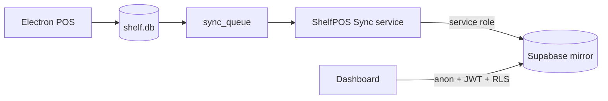

# ShelfPOS Wiki

> **For humans:** start here, then follow links by role.  
> **For AI agents:** read [[17-Conventions-For-AI]] first, then the area you are editing.

## What is ShelfPOS?

ShelfPOS is an **offline-first retail POS** for small shops (Costa Rica focus) with an optional **cloud dashboard**. Data lives in **SQLite on the cashier PC**; a background **sync service** mirrors changes to **Supabase**; the **dashboard** reads that mirror for owners/managers.

## Monorepo layout

| Folder | App | Stack |
|--------|-----|-------|
| `OFFLINE-ONLY-POS/` | Cashier + admin on Windows | Electron 28+, React 19, better-sqlite3 |
| `OFFLINE-ONLY-POS/sync-service/` | Background sync | Node 24+, better-sqlite3, REST → Supabase |
| `DASHBOARD/` | Owner web panel | TanStack Start, React 19, Supabase JS |

There is **no root package.json** — each project installs independently.

## Wiki map

### Start here
- [[01-Repository-Overview]]
- [[02-Architecture]]
- [[03-Data-Flow]]

### Security & tenancy
- [[04-Multi-Tenant-Security]]

### Schema
- [[05-SQLite-Schema]]
- [[06-Supabase-Schema]]

### POS (Electron)
- [[07-POS-Main-Process]]
- [[08-POS-Renderer]]
- [[09-IPC-Reference]]
- [[16-Error-Handling]]

### Cloud
- [[10-Sync-Service]]
- [[11-Dashboard]]
- [[12-Reports-And-Exports]]
- [[13-Factura-PDF]]

### Ops
- [[14-Environment-Variables]]
- [[15-Setup-And-Deployment]]

### AI / contributors
- [[17-Conventions-For-AI]]
- [[18-Quality-And-Tooling]]

## Quick paths by role

| I want to… | Read |
|------------|------|
| Fix a sale bug | [[03-Data-Flow]] → [[09-IPC-Reference]] → `OFFLINE-ONLY-POS/src/main/ipc/sales.ts` |
| Fix sync | [[10-Sync-Service]] → `sync-service/src/sync.ts` |
| Fix dashboard KPIs | [[11-Dashboard]] → `DASHBOARD/src/lib/queries/dashboard.ts` |
| Add a report | [[12-Reports-And-Exports]] |
| Change Supabase schema | [[06-Supabase-Schema]] → `DASHBOARD/SUPA.sql` |
| Onboard a new store owner | [[15-Setup-And-Deployment]] (production checklist) |
| Lint / Doctor before commit | [[18-Quality-And-Tooling]] |
| Production link POS → dashboard | [[15-Setup-And-Deployment#Link POS to owner (production, per shop)]] |
| Multi-tenant / RLS | [[04-Multi-Tenant-Security]] |
| Invoice PDF layout | [[13-Factura-PDF]] |

## Canonical source files

| Concern | Path |
|---------|------|
| SQLite migrations | `OFFLINE-ONLY-POS/src/main/db/migrations.ts` |
| Sync enqueue | `OFFLINE-ONLY-POS/src/main/db/repos/syncQueue.ts` |
| Supabase schema | `DASHBOARD/SUPA.sql` |
| Dashboard auth | `DASHBOARD/src/lib/auth.tsx` |
| Store tenancy UI | `DASHBOARD/src/routes/_app/link-pos.tsx` |

## Lint & quality

See [[18-Quality-And-Tooling]] for full checklist.

- **POS:** `npm run lint` (typecheck + eslint)
- **Dashboard:** `npm run lint`
- **React Doctor:** `npm run doctor` in each app (changed scope); use `--scope full` for baseline or docs-only commits
- **Sync:** `npm run build` in `sync-service/`
- **Branch review:** Bugbot on branch diff before PR
