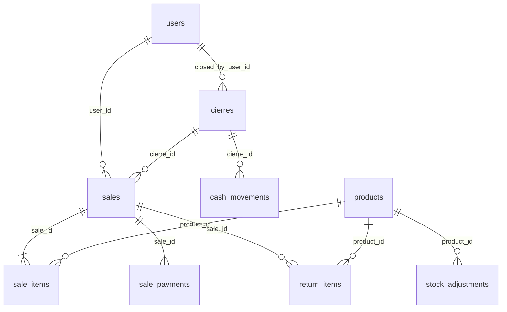

# Database Reference

Parent: [LLM Index](README.md)

**Canonical sources:**
- SQLite: `shelfPos/src/main/db/migrations.ts` (`SCHEMA_VERSION = 21`)
- Supabase: `DASHBOARD/SUPA.sql`
- Sync column maps: `OFFLINE-ONLY-POS/sync-service/src/db.ts` → `LIVE_ROW_SQL`

**Data directory:** `%APPDATA%\shelfpos\shelf.db` (override: `SHELFPOS_DATA_DIR`)

---

## SQLite tables

### `settings`

**Purpose:** Key-value store configuration.

| Key (examples) | Purpose |
|----------------|---------|
| `sync_store_id` | Tenant id stamped on Supabase rows |
| `store_name` | Display name |
| `scanner_burst_ms` | Barcode scanner timing (default 30) |
| `sync_owner_claimed` | Set after successful cloud claim |
| `pos_last_seen_at` | Heartbeat for dashboard presence |
| Tax, printer, PIN hashes | Store config |

**Synced:** No

---

### `users`

**Purpose:** POS login accounts with `password_hash`.

| Column | Notes |
|--------|-------|
| `username` | UNIQUE (case-insensitive) |
| `role` | sales \| product_manager \| admin |
| `is_active` | Login gate |

**Synced:** No (mirror is `pos_users` without passwords). Hidden `SAKEN` recovery user never synced.

---

### `products`

**Purpose:** Sellable catalog items.

| Column | Notes |
|--------|-------|
| `id` | INTEGER PK |
| `barcode` | UNIQUE — POS scan lookup; soft-deleted rows tombstoned as `@deleted:{id}:{barcode}` (v21) so codes can be reused |
| `name`, `price`, `cost_price` | Catalog |
| `category` | Optional grouping |
| `stock`, `stock_threshold` | Inventory |
| `stock_provider` | Optional supplier label (v20) |
| `tax_category` | IVA handling |
| `bulk_qty`, `bulk_price` | Volume pricing |
| `factura_negativo` | Invoice display |
| `deleted_at` | Soft delete (v9) |
| `created_at`, `updated_at` | Timestamps |

**Relationships:**
```
products.id → sale_items.product_id (nullable for misc)
products.id → stock_adjustments.product_id
products.id → return_items.product_id
```

**Synced:** Yes

---

### `sales`

**Purpose:** Sale / ticket header.

| Column | Notes |
|--------|-------|
| `id` | INTEGER PK |
| `user_id` | Cashier |
| `total` | After discounts |
| `cart_discount`, line discounts | Stored on header/lines |
| Customer fields | Optional name, cédula, etc. |
| `cierre_id` | Shift link |
| `consecutivo` | Invoice sequence |
| `created_at` | Timestamp |

**Relationships:**
```
sales.id → sale_items.sale_id
sales.id → sale_payments.sale_id
sales.id → return_items.sale_id
cierres.id → sales.cierre_id
```

**Synced:** Yes

---

### `sale_items`

**Purpose:** Line items on a sale.

| Column | Notes |
|--------|-------|
| `sale_id` | Parent sale |
| `product_id` | NULL for misc lines |
| `product_name_snapshot` | Name at checkout |
| `barcode_snapshot` | Barcode at checkout (v14) |
| `quantity`, `unit_price`, `line_total` | Economics |
| `discount` | Line discount amount |

**Synced:** Yes

---

### `sale_payments`

**Purpose:** Split payment rows (canonical for reports).

| Column | Notes |
|--------|-------|
| `sale_id` | Parent |
| `method` | cash \| card \| sinpe |
| `amount` | Portion of total |

**Synced:** Yes

---

### `cierres`

**Purpose:** Shift close record.

Totals by payment method, cash count, discrepancy, `closed_by_user_id`, timestamps.

**Synced:** Yes

---

### `cash_movements`

**Purpose:** opening_float, cash_in, cash_out during shift.

**Synced:** Yes

---

### `return_items`

**Purpose:** Return/refund lines linked to original sale.

| Notes |
|-------|
| `sale_item_id` for misc returns path (v13) — misc still not in return UI search |
| `restocked` flag |

**Synced:** Yes

---

### `stock_adjustments`

**Purpose:** Manual inventory corrections.

| Column | Notes |
|--------|-------|
| `product_id`, `delta` | Signed change |
| `user_id`, `reason` | Audit |

**Synced:** Yes

---

### `audit_log`

**Purpose:** Security and operational audit trail.

Examples: `cart_tab_discarded_caja`, discount overrides. **Synced:** Yes

---

### `cart_tabs` (local)

**Purpose:** Multi-cart snapshots on one register.

| Column | Notes |
|--------|-------|
| `cart_json` | `{ cart, cartDiscount, customer }` |
| `label`, `sort_order` | UI |

**Synced:** No

---

### `sync_queue`

**Purpose:** Outbound mirror job queue.

| Column | Notes |
|--------|-------|
| `table_name`, `row_id`, `operation` | insert \| update \| delete |
| `status` | pending \| synced \| error |
| `retry_count` | Max 10 |

**Synced:** No

---

### `print_jobs` (local)

**Purpose:** Thermal receipt print queue. **Synced:** No

---

## Supabase mirror tables

All include `store_id TEXT NOT NULL` and composite PK `(id, store_id)`.

| Table | Notes |
|-------|-------|
| `products` | Includes `stock_provider`, `deleted_at` |
| `sales`, `sale_items`, `sale_payments` | Mirror of POS sales |
| `cierres`, `cash_movements` | Shift data |
| `audit_log`, `return_items`, `stock_adjustments` | Ops data |
| `pos_users` | Team roster (no passwords) |
| `stores` | Registry + heartbeat |
| `store_access` | Owner/viewer membership |
| `store_pairings` | Link codes |

**Tenancy helpers:** `can_access_store()`, `claim_store_sync()` — see `SUPA.sql`.

---

## Entity relationship diagram



---

## Schema change checklist

When adding a synced column:

1. `migrations.ts` — bump `SCHEMA_VERSION`
2. `columns.ts` / repos
3. `sync-service/src/db.ts` — `LIVE_ROW_SQL`
4. `DASHBOARD/SUPA.sql` — CREATE + ALTER patch
5. Run `SUPA.sql` on Supabase
6. `schemas/ipc.ts` + locales if user-facing

---

## Related

- [Wiki: SQLite schema](../wiki/05-SQLite-Schema.md)
- [Wiki: Supabase schema](../wiki/06-Supabase-Schema.md)
